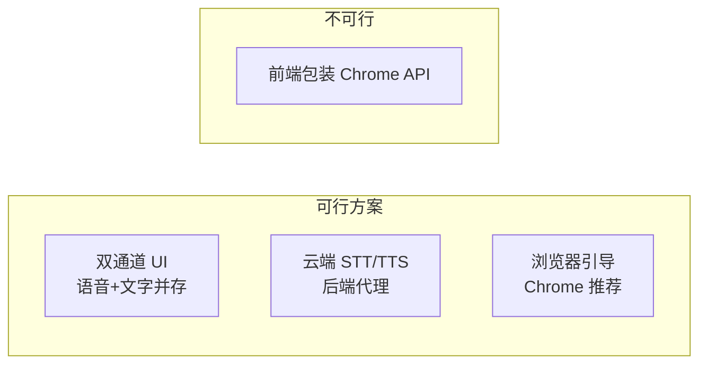
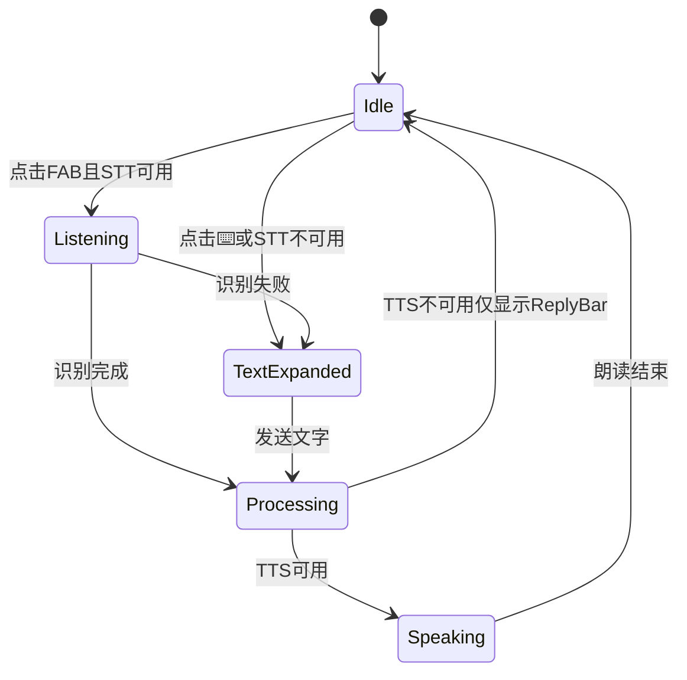

# 浏览器语音兼容与文字输入降级方案

> 状态：**Phase 1 已实施**（VoiceChatBar + VoiceReplyBar）；Phase 2/3 待做
> 关联：[VOICE_UX_PLAN.md](./VOICE_UX_PLAN.md) · [ARCHITECTURE.md](./ARCHITECTURE.md)
> 撰写日期：2026-08-30 · FAQ 补充：2026-08-30

---

## 1. 问题描述

用户反馈：

1. **非 Chrome / 部分浏览器** STT 或 TTS 不可用
2. 文档说「可文字输入」，但 **界面上找不到打字入口**
3. 能否「包装 Chrome API」让其他浏览器也能用？

---

## 2. 现状代码分析（Phase 1 已实施）

### 2.1 当前降级逻辑（VoiceChatBar.tsx）

```tsx
// 左侧 ⌨️/🎤 始终可见，一键切换语音 / 键盘模式
{mode === "voice" ? (
  <button>点击说话</button>
) : (
  <input + Send />
)}

// STT 不可用 → 默认文字模式
if (!isSTTSupported()) setMode("text");

// STT 运行时失败 → 自动切文字 + 提示
onError(err) { switchToText(); showHint(...); }
```

| 场景 | `isSTTSupported()` | 实际体验 | 有无打字入口 |
|------|-------------------|----------|-------------|
| Chrome 手机 | ✅ true | 正常 | ✅ 点 ⌨️ 切换 |
| Edge 桌面 | ✅ true | 通常正常（微软音色） | ✅ 点 ⌨️ 切换 |
| Firefox | ❌ false | 无法语音识别 | ✅ 默认文字模式 |
| QQ 浏览器 | ✅ true（API 存在） | STT 常失败/不稳定 | ✅ 失败后自动切文字 |
| 微信内置浏览器 | 可能 true | 麦克风权限被拒 | ✅ 失败后自动切文字 |
| 荣耀/华为无 GMS | 可能 true | STT 运行时失败 | ✅ 失败后自动切文字 |
| VM / 沙箱环境 | ✅ true | TTS 可能失败 | ✅ 文字 + ReplyBar |

**结论：Phase 1 已实现「语音优先、文字兜底」，两种入口始终可用。**

### 2.2 语音入口位置

`VoiceChatBar` 固定在 **所有 Tab** 底部导航上方，全局可用。  
`VoiceController.tsx` 已删除（逻辑由 `VoiceChatBar` 接管）。

### 2.3 TTS 降级

TTS 不可用时：`handleAgentReply` 仍执行 Agent 逻辑，`speak()` 跳过。  
**文字回复**由全局 `VoiceReplyBar` 显示，任意 Tab 可见。

---

## 3. 核心结论：能否「包装 Chrome API」？

### ❌ 不能在前端包装/转发 Chrome 的 Web Speech API

| 方案 | 可行性 | 原因 |
|------|--------|------|
| JS  polyfill 调用 Chrome API | **不可行** | Web Speech API 是浏览器内核能力，QQ/Firefox/Safari 无法通过 JS 调用 Chrome 的实现 |
| iframe 嵌 Chrome | **不可行** | 跨浏览器、移动端、安全策略均不允许 |
| User-Agent 伪装 | **无效** | 能力由引擎决定，不是 UA 字符串 |
| 引导用户「用 Chrome 打开」 | **可行** | 仅提示，不能解决坚持不换浏览器的用户 |

### ✅ 可行路径只有三类



| 路径 | 成本 | 兼容性 | 推荐 |
|------|------|--------|------|
| **A. 双通道 UI** | 低，纯前端 | 100% 可输入；TTS 仍依赖浏览器 | **首选，Phase 1 必做** |
| **B. 云端 STT/TTS** | 高，需后端+Key+计费 | 全浏览器可播可识 | 未来可选 |
| **C. 浏览器引导 Banner** | 极低 | 辅助 | 配合 A 使用 |

**本项目是 GitHub Pages 静态站，无后端。** 短期最佳方案是 **A + C**，不是包装 Chrome API。

---

## 4. 推荐方案：双通道输入 + 运行时降级

### 4.1 设计原则

> **语音优先，文字兜底 — 两种入口始终可见，不互斥。**

类似微信/chat：底部输入条 + 语音按钮切换，而不是「不支持才显示输入框」。

### 4.2 UI 方案（配合 VOICE_UX_PLAN 全局 FAB）

#### 方案 A：FAB + 可展开输入条（推荐）

```
默认态：
                    ┌────┐
                    │ 🎤 │  ← 点击开始说话
                    └────┘
                    ⌨️      ← 小键盘图标，点击展开输入条

展开输入态：
┌──────────────────────────────┐
│ [  输入文字与 Bella 对话... ] │ [发送]
└──────────────────────────────┘
                    ┌────┐
                    │ 🎤 │
                    └────┘
```

| 元素 | 行为 |
|------|------|
| 🎤 FAB | 始终显示；STT 不可用时点击 → 自动展开文字输入 + 提示 |
| ⌨️ 小按钮 | 始终显示在 FAB 旁或下方；展开/收起输入条 |
| 输入条 | 展开后固定底栏上方，Enter 发送 |

#### 方案 B：Chat 式底栏（备选）

```
┌──────────────────────────────┐
│ [🎤] [  输入消息...        ] [↑] │
└──────────────────────────────┘
│  首页  宠物  学习  设置        │
```

- 左：按住说话 / 点击切语音模式
- 中：文字输入（始终存在）
- 右：发送

**推荐方案 A**：与豆包 FAB 心智一致，平时不占空间，需要打字一键展开。

### 4.3 运行时降级（Runtime Fallback）

不仅检测 API 是否存在，还处理 **运行时失败**：

```typescript
type InputMode = "voice" | "text" | "auto";

// 逻辑
onMicClick() {
  if (!isSTTSupported()) {
    expandTextInput();
    showHint("当前浏览器不支持语音，请用文字输入");
    return;
  }
  startListening(
    onResult,
    (err) => {
      // 权限拒绝 / network / no-speech 等
      if (err.includes("权限") || err.includes("不支持") || err.includes("network")) {
        expandTextInput();  // 自动展开打字
        showHint("语音识别失败，已切换为文字输入");
      }
    }
  );
}
```

| 失败类型 | 当前行为 | 规划行为 |
|----------|----------|----------|
| 麦克风权限被拒 | 报错 3 秒消失 | 自动展开输入条 + 持久提示 |
| STT network 错误 | 报错消失 | 展开输入条 |
| API 不存在 | 显示输入框（仅宠物 Tab） | 全局 FAB 旁 ⌨️ + 输入条 |
| TTS 失败 | amber 小字提示 | ReplyBar **始终显示文字回复**（不依赖朗读） |

### 4.4 TTS 降级：视觉回复优先

```typescript
handleAgentReply(text) {
  const response = processUserInput(text);
  onAgentResponse(response);  // 始终更新 ReplyBar 文字

  if (ttsSupported) {
    speak(response.reply, onEnd, speed);  // 有则朗读
  }
  // 无 TTS 时：ReplyBar 已显示文字，用户仍可阅读
}
```

**原则：TTS 是增强，文字回复是保底。** 不因 TTS 失败而丢失交互反馈。

---

## 5. 浏览器引导策略

### 5.1 首次访问检测 Banner

```
┌─────────────────────────────────────────┐
│ 💡 为获得最佳语音体验，建议使用 Chrome 浏览器  [知道了]
└─────────────────────────────────────────┘
```

触发条件（满足任一）：
- `!isSTTSupported()` 或 `!isSpeechSupported()`
- 首次 STT/TTS 运行时失败
- User-Agent 含 MicroMessenger（微信）

存储：`localStorage.voice_hint_dismissed = true`，关闭后不再显示。

### 5.2 设置页能力面板（增强现有）

```
🎙️ 语音能力
  语音合成: ✅ 支持 / ❌ 不可用
  语音识别: ✅ 支持 / ❌ 不可用
  当前模式: 🎤 语音 + ⌨️ 文字（推荐）

  [切换到纯文字模式]  ← 用户可手动强制文字输入
```

---

## 6. 云端 STT/TTS 备选（未来，非 Phase 1）

若需 **全浏览器** 语音输入输出，必须走后端：

| 服务 | STT | TTS | 国内 | 免费额度 | 静态站可用 |
|------|-----|-----|------|----------|-----------|
| 腾讯云 ASR/TTS | ✅ | ✅ | ✅ | 试用 | 需 Worker 代理 + Secret |
| 百度语音 | ✅ | ✅ | ✅ | 试用 | 需 Worker 代理 + Secret |
| Google STT/TTS | ✅ | ✅ | ❌ 被墙 | 有 | 需 Worker |
| Edge-TTS | ❌ | ✅ | ❌ 403 | 免费 | 已放弃 |
| Azure | ✅ | ✅ | 看区域 | 有 | 需 Worker |

**架构：**

```
浏览器 → Cloudflare Worker（持有 API Key）→ 腾讯云/百度
         ↓
       返回文本/音频 URL
```

**不推荐 Phase 1 引入的原因：**
- 需注册云账号、配置 Secret、处理计费
- GitHub Pages 无法隐藏 Key，必须 Worker 中转
- 与「零成本静态站」定位冲突

**可作为 Phase 3+ 可选增强：** 设置页提供「云端语音（实验性）」开关，Worker URL 由部署者配置。

---

## 7. 组件改造计划

### 7.1 新增/重构

| 组件 | 职责 |
|------|------|
| `VoiceFAB` | 悬浮麦克风，全局 |
| `VoiceInputBar` | 可展开文字输入条，全局 |
| `VoiceReplyBar` | 全局文字回复（TTS 降级保底） |
| `useVoiceCapabilities` | hook：检测 STT/TTS + 运行时失败状态 |
| `BrowserHintBanner` | 非 Chrome / 能力缺失提示 |

### 7.2 状态机



### 7.3 speech.ts 小改动

```typescript
// 新增：综合判断输入方式
export function getPreferredInputMode(): "voice" | "text" {
  if (!isSTTSupported()) return "text";
  // 可选：读 localStorage 用户强制文字模式
  if (localStorage.getItem("force_text_input") === "1") return "text";
  return "voice";
}

export function isSpeechSupported(): boolean { ... }  // 保持
export function isSTTSupported(): boolean { ... }      // 保持
// 注意：isSTTSupported 只表示 API 存在，不保证运行时成功
```

---

## 8. 实施分期

### Phase 1 — 双通道 UI（与 VOICE_UX_PLAN Phase 1 合并）

- [x] 全局 `VoiceChatBar`（⌨️/🎤 双模式，类微信/豆包）
- [x] STT 失败 / 权限拒绝 → 自动切文字输入
- [x] `VoiceReplyBar` 全局显示，TTS 失败仍可见文字回复
- [ ] `BrowserHintBanner` 非 Chrome / 华为荣耀专项提示

### Phase 2

- [ ] 设置页「强制文字模式」开关
- [ ] 运行时能力重检（`speechSynthesis.getVoices().length`）
- [ ] 微信内置浏览器专项提示「在浏览器中打开」

### Phase 3（可选）

- [ ] Cloudflare Worker + 腾讯云 STT/TTS 实验性后端
- [ ] 设置页配置 Worker URL

---

## 9. 决策记录

| 问题 | 结论 |
|------|------|
| 能否包装 Chrome API 给其他浏览器？ | **不能**，只能 UI 降级或云端替代 |
| 是否只能用 Google 语音？ | **不是**。网站调用 Web Speech API，由**各浏览器**接入 Google / 微软 / 苹果 / 系统本地引擎 |
| Microsoft Edge 浏览器能用吗？ | **能**。Edge（Chromium）同样支持 Web Speech API，Windows 上 TTS 常用微软音色，体验良好 |
| Edge-TTS 和 Edge 浏览器是一回事吗？ | **不是**。Edge 浏览器 = 客户端；Edge-TTS = 微软云端朗读 API（项目已放弃，国内 403） |
| 打字入口为什么没有？ | Phase 1 已修复：VoiceChatBar 全局 ⌨️ 切换 |
| 最佳兼容方案？ | **语音+文字双入口始终可见** + 运行时失败自动切文字 |
| 是否需要云端？ | Phase 1 不需要；全浏览器语音才需要 |

---

## 10. 附录：各浏览器实际表现速查

| 浏览器 | TTS | STT | 背后引擎（典型） | 建议输入方式 |
|--------|-----|-----|------------------|-------------|
| Chrome Android | ✅ | ✅（需联网） | Google 云端 STT + 系统/Google 音色 | 语音为主 |
| Chrome Desktop | ✅ | ✅ | Google 云端 STT | 语音为主 |
| **Edge Desktop** | ✅ | ✅ | **微软音色** TTS；STT 走 Chromium 识别链路 | **语音为主，Windows 推荐** |
| Edge Android | ✅ | ⚠️ 看机型 | 同 Chromium，依赖系统服务 | 语音 + 文字 |
| Safari iOS | ✅ | 部分 | Apple 语音 | 语音 + 文字 |
| QQ 浏览器 | ✅ | ⚠️ 不稳定 | 混合/受限 | **文字为主** |
| UC 浏览器 | 部分 | ⚠️ | 混合/受限 | **文字为主** |
| Firefox | ✅ | ❌ | 本地 TTS，无 STT API | **纯文字** |
| 微信内置 | 部分 | ❌ 常拒权限 | 受限 WebView | **纯文字** + 引导「浏览器打开」 |
| **荣耀/华为（无 GMS）** | ⚠️ | ❌ 即装 Chrome 也常失败 | 缺 Google 移动服务 | **纯文字** |

> 文档写「Chrome 最佳」指 **Android 移动端** 兼容面最广，**不等于只能用 Chrome**。Windows 上 Edge 同样推荐。

---

## 11. 用户 FAQ（常见疑问）

### Q1：荣耀/华为手机装了 Chrome，为什么语音还是不行？小米却可以

**不是网站 bug，是手机系统环境差异。**

Chrome 的语音识别（STT）**不是纯本地**，流程大致为：

```
麦克风 → Chrome → 云端语音服务（通常 Google）→ 返回文字
```

因此除了安装 Chrome，还需要：

| 条件 | 小米（常见） | 荣耀/华为（常见） |
|------|-------------|-------------------|
| 已安装 Chrome | ✅ | ✅ |
| Google 移动服务 GMS | ✅ 多数可装 | ❌ 2019 后很多机型官方不支持 |
| 可连 Google 语音后端 | ✅ 相对容易 | ❌ 常缺失或被限制 |
| Chrome 语音实际可用 | ✅ | ❌ 常报「无 Google 搜索引擎/语音服务不可用」 |

**结论：装了 Chrome APK ≠ 具备 Google 语音能力。** 小米往往能装完整 GMS；荣耀/华为即使用 Chrome，STT 仍可能在运行时失败。此时请用底部 **⌨️ 键盘文字输入**。

部分独立后的新荣耀海外版若预装 GMS，语音**有可能**可用，因机型差异大，需实测。

### Q2：是不是只能用 Google 语音？微软 Edge 可以吗？

**不是只能用 Google。** 本项目不绑定任何厂商，只调用浏览器标准 **Web Speech API**：

```
网站 speech.ts
    ↓
SpeechSynthesis / SpeechRecognition（浏览器标准接口）
    ↓
各浏览器自己的实现（Google / 微软 / 苹果 / 系统本地）
```

| 产品 | 能否用于本项目 | 说明 |
|------|----------------|------|
| **Microsoft Edge 浏览器** | ✅ 推荐 | Chromium 内核，Windows 上 TTS 常用微软中文音色 |
| Google Chrome 浏览器 | ✅ 推荐 | Android 上兼容面最广 |
| **Edge-TTS 云端服务** | ❌ 已放弃 | 与 Edge 浏览器无关；国内 403，见 ARCHITECTURE.md |

**Edge 浏览器打开同一链接即可**，无需改代码。

### Q3：为什么网站不能「包装一下」让 Firefox / QQ / 荣耀也用 Google 语音？

Web Speech API 是**浏览器内核 + 系统服务**能力，网页 JavaScript **无法**：

- 把 Firefox 的调用转发给 Chrome 的实现
- 在缺 GMS 的荣耀机上「借用」Google 云端
- 用 iframe 或 UA 伪装骗过能力检测

可行路径只有：

1. **UI 降级**（已做）：文字输入 + ReplyBar 文字回复
2. **换支持语音的浏览器/设备**：Chrome、Edge、带 GMS 的 Android
3. **云端 STT/TTS**（未来 Phase 3）：腾讯云/百度 ASR+TTS，经 Worker 代理，可覆盖全浏览器，但需账号与费用

### Q4：TTS 朗读和 STT 识别，分别依赖什么？

| 功能 | API | 典型依赖 | 离线？ |
|------|-----|----------|--------|
| TTS 朗读 | `SpeechSynthesis` | 系统已安装语音包 / 浏览器音色 | 部分可离线 |
| STT 识别 | `SpeechRecognition` | **通常需联网** + 浏览器厂商云端 | 否（Chrome 走 Google 云端） |

TTS 失败：检查系统「文字转语音」是否安装中文包；设置页看「语音合成: ✅/❌」。  
STT 失败：检查麦克风权限、网络；不支持则切 ⌨️ 文字模式。

### Q5：各场景一句话建议

| 你的环境 | 建议 |
|----------|------|
| Windows 电脑 | **Edge 或 Chrome**，语音一般可用 |
| 小米等可装 GMS 的 Android | Chrome / Edge |
| 荣耀/华为、QQ 浏览器、微信内打开 | **⌨️ 文字输入** |
| Firefox | 可朗读，**不能语音输入**，请打字 |
| 必须要荣耀上也「说话学习」 | 需 Phase 3 云端语音（腾讯云/百度），非当前静态站能力 |
