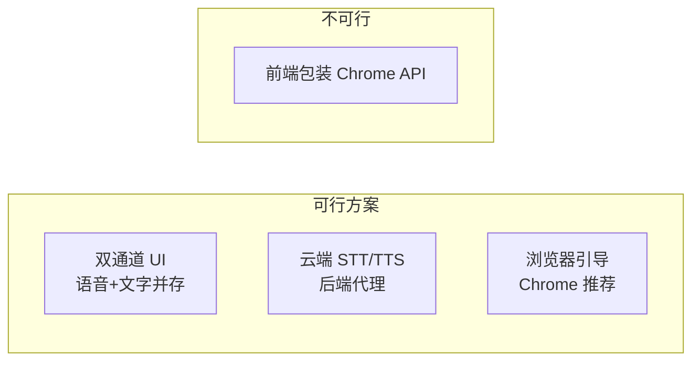
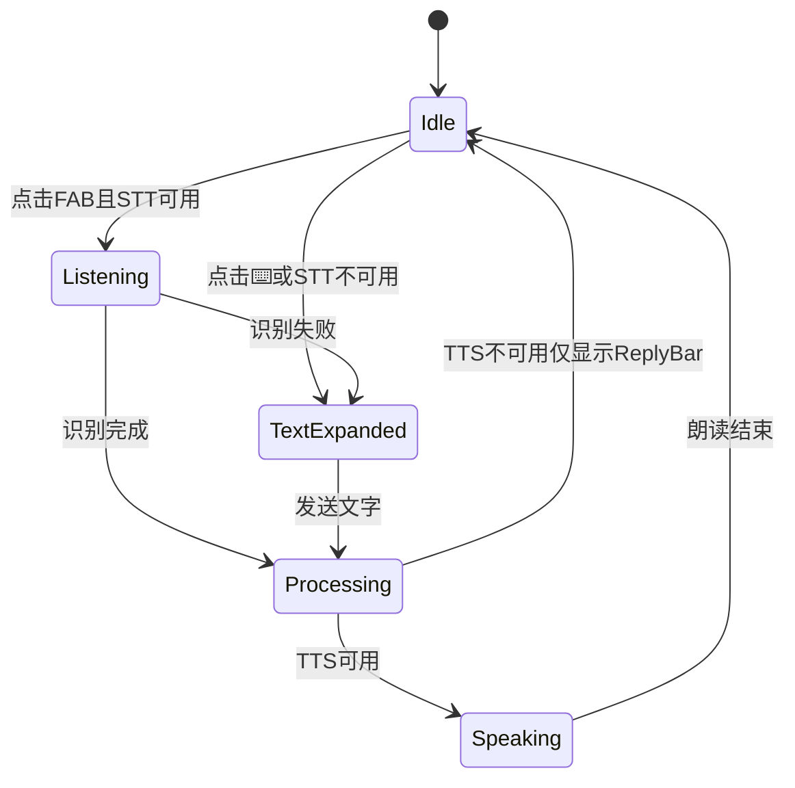

# 浏览器语音兼容与文字输入降级方案

> 状态：**规划稿**（待评审后实施）
> 关联：[VOICE_UX_PLAN.md](./VOICE_UX_PLAN.md) · [ARCHITECTURE.md](./ARCHITECTURE.md)
> 撰写日期：2026-08-30

---

## 1. 问题描述

用户反馈：

1. **非 Chrome / 部分浏览器** STT 或 TTS 不可用
2. 文档说「可文字输入」，但 **界面上找不到打字入口**
3. 能否「包装 Chrome API」让其他浏览器也能用？

---

## 2. 现状代码分析

### 2.1 当前降级逻辑（VoiceController.tsx）

```tsx
{sttSupported ? (
  <button>🎤 麦克风</button>      // STT 可用 → 只显示麦克风
) : (
  <input + Send />                 // STT 不可用 → 才显示文字输入
)}
```

**问题：二选一设计，导致多种场景没有打字入口：**

| 场景 | `isSTTSupported()` | 实际体验 | 有无打字入口 |
|------|-------------------|----------|-------------|
| Chrome 手机 | ✅ true | 正常 | ❌ 无（只有麦） |
| Firefox | ❌ false | 无法语音识别 | ✅ 有 |
| QQ 浏览器 | ✅ true（API 存在） | STT 常失败/不稳定 | ❌ 无（只有麦，失败只报错） |
| 微信内置浏览器 | 可能 true | 麦克风权限被拒 | ❌ 无 |
| Chrome 但拒绝麦克风权限 | ✅ true | 点击麦 → 报错 | ❌ 无 |
| VM / 沙箱环境 | ✅ true | TTS synthesis-failed | ❌ 无 |

**结论：只有「API 完全不存在」才显示输入框；「API 存在但运行时失败」的用户被卡住。**

### 2.2 语音入口位置

`VoiceController` 仅在 **宠物 Tab** 底部。其他 Tab 完全没有语音/文字入口。

### 2.3 TTS 降级

TTS 不可用时：`handleAgentReply` 仍执行 Agent 逻辑，但 `speak()` 跳过，只显示一行 amber 提示。  
**文字回复**依赖 `lastReply` 气泡，且 **只在宠物 Tab 显示** — 其他 Tab 连看都看不到。

---

## 3. 核心结论：能否「包装 Chrome API」？

### ❌ 不能在前端包装/转发 Chrome 的 Web Speech API

| 方案 | 可行性 | 原因 |
|------|--------|------|
| JS  polyfill 调用 Chrome API | **不可行** | Web Speech API 是浏览器内核能力，QQ/Firefox/Safari 无法通过 JS 调用 Chrome 的实现 |
| iframe 嵌 Chrome | **不可行** | 跨浏览器、移动端、安全策略均不允许 |
| User-Agent 伪装 | **无效** | 能力由引擎决定，不是 UA 字符串 |
| 引导用户「用 Chrome 打开」 | **可行** | 仅提示，不能解决坚持不换浏览器的用户 |

### ✅ 可行路径只有三类



| 路径 | 成本 | 兼容性 | 推荐 |
|------|------|--------|------|
| **A. 双通道 UI** | 低，纯前端 | 100% 可输入；TTS 仍依赖浏览器 | **首选，Phase 1 必做** |
| **B. 云端 STT/TTS** | 高，需后端+Key+计费 | 全浏览器可播可识 | 未来可选 |
| **C. 浏览器引导 Banner** | 极低 | 辅助 | 配合 A 使用 |

**本项目是 GitHub Pages 静态站，无后端。** 短期最佳方案是 **A + C**，不是包装 Chrome API。

---

## 4. 推荐方案：双通道输入 + 运行时降级

### 4.1 设计原则

> **语音优先，文字兜底 — 两种入口始终可见，不互斥。**

类似微信/chat：底部输入条 + 语音按钮切换，而不是「不支持才显示输入框」。

### 4.2 UI 方案（配合 VOICE_UX_PLAN 全局 FAB）

#### 方案 A：FAB + 可展开输入条（推荐）

```
默认态：
                    ┌────┐
                    │ 🎤 │  ← 点击开始说话
                    └────┘
                    ⌨️      ← 小键盘图标，点击展开输入条

展开输入态：
┌──────────────────────────────┐
│ [  输入文字与 Bella 对话... ] │ [发送]
└──────────────────────────────┘
                    ┌────┐
                    │ 🎤 │
                    └────┘
```

| 元素 | 行为 |
|------|------|
| 🎤 FAB | 始终显示；STT 不可用时点击 → 自动展开文字输入 + 提示 |
| ⌨️ 小按钮 | 始终显示在 FAB 旁或下方；展开/收起输入条 |
| 输入条 | 展开后固定底栏上方，Enter 发送 |

#### 方案 B：Chat 式底栏（备选）

```
┌──────────────────────────────┐
│ [🎤] [  输入消息...        ] [↑] │
└──────────────────────────────┘
│  首页  宠物  学习  设置        │
```

- 左：按住说话 / 点击切语音模式
- 中：文字输入（始终存在）
- 右：发送

**推荐方案 A**：与豆包 FAB 心智一致，平时不占空间，需要打字一键展开。

### 4.3 运行时降级（Runtime Fallback）

不仅检测 API 是否存在，还处理 **运行时失败**：

```typescript
type InputMode = "voice" | "text" | "auto";

// 逻辑
onMicClick() {
  if (!isSTTSupported()) {
    expandTextInput();
    showHint("当前浏览器不支持语音，请用文字输入");
    return;
  }
  startListening(
    onResult,
    (err) => {
      // 权限拒绝 / network / no-speech 等
      if (err.includes("权限") || err.includes("不支持") || err.includes("network")) {
        expandTextInput();  // 自动展开打字
        showHint("语音识别失败，已切换为文字输入");
      }
    }
  );
}
```

| 失败类型 | 当前行为 | 规划行为 |
|----------|----------|----------|
| 麦克风权限被拒 | 报错 3 秒消失 | 自动展开输入条 + 持久提示 |
| STT network 错误 | 报错消失 | 展开输入条 |
| API 不存在 | 显示输入框（仅宠物 Tab） | 全局 FAB 旁 ⌨️ + 输入条 |
| TTS 失败 | amber 小字提示 | ReplyBar **始终显示文字回复**（不依赖朗读） |

### 4.4 TTS 降级：视觉回复优先

```typescript
handleAgentReply(text) {
  const response = processUserInput(text);
  onAgentResponse(response);  // 始终更新 ReplyBar 文字

  if (ttsSupported) {
    speak(response.reply, onEnd, speed);  // 有则朗读
  }
  // 无 TTS 时：ReplyBar 已显示文字，用户仍可阅读
}
```

**原则：TTS 是增强，文字回复是保底。** 不因 TTS 失败而丢失交互反馈。

---

## 5. 浏览器引导策略

### 5.1 首次访问检测 Banner

```
┌─────────────────────────────────────────┐
│ 💡 为获得最佳语音体验，建议使用 Chrome 浏览器  [知道了]
└─────────────────────────────────────────┘
```

触发条件（满足任一）：
- `!isSTTSupported()` 或 `!isSpeechSupported()`
- 首次 STT/TTS 运行时失败
- User-Agent 含 MicroMessenger（微信）

存储：`localStorage.voice_hint_dismissed = true`，关闭后不再显示。

### 5.2 设置页能力面板（增强现有）

```
🎙️ 语音能力
  语音合成: ✅ 支持 / ❌ 不可用
  语音识别: ✅ 支持 / ❌ 不可用
  当前模式: 🎤 语音 + ⌨️ 文字（推荐）

  [切换到纯文字模式]  ← 用户可手动强制文字输入
```

---

## 6. 云端 STT/TTS 备选（未来，非 Phase 1）

若需 **全浏览器** 语音输入输出，必须走后端：

| 服务 | STT | TTS | 国内 | 免费额度 | 静态站可用 |
|------|-----|-----|------|----------|-----------|
| 腾讯云 ASR/TTS | ✅ | ✅ | ✅ | 试用 | 需 Worker 代理 + Secret |
| 百度语音 | ✅ | ✅ | ✅ | 试用 | 需 Worker 代理 + Secret |
| Google STT/TTS | ✅ | ✅ | ❌ 被墙 | 有 | 需 Worker |
| Edge-TTS | ❌ | ✅ | ❌ 403 | 免费 | 已放弃 |
| Azure | ✅ | ✅ | 看区域 | 有 | 需 Worker |

**架构：**

```
浏览器 → Cloudflare Worker（持有 API Key）→ 腾讯云/百度
         ↓
       返回文本/音频 URL
```

**不推荐 Phase 1 引入的原因：**
- 需注册云账号、配置 Secret、处理计费
- GitHub Pages 无法隐藏 Key，必须 Worker 中转
- 与「零成本静态站」定位冲突

**可作为 Phase 3+ 可选增强：** 设置页提供「云端语音（实验性）」开关，Worker URL 由部署者配置。

---

## 7. 组件改造计划

### 7.1 新增/重构

| 组件 | 职责 |
|------|------|
| `VoiceFAB` | 悬浮麦克风，全局 |
| `VoiceInputBar` | 可展开文字输入条，全局 |
| `VoiceReplyBar` | 全局文字回复（TTS 降级保底） |
| `useVoiceCapabilities` | hook：检测 STT/TTS + 运行时失败状态 |
| `BrowserHintBanner` | 非 Chrome / 能力缺失提示 |

### 7.2 状态机



### 7.3 speech.ts 小改动

```typescript
// 新增：综合判断输入方式
export function getPreferredInputMode(): "voice" | "text" {
  if (!isSTTSupported()) return "text";
  // 可选：读 localStorage 用户强制文字模式
  if (localStorage.getItem("force_text_input") === "1") return "text";
  return "voice";
}

export function isSpeechSupported(): boolean { ... }  // 保持
export function isSTTSupported(): boolean { ... }      // 保持
// 注意：isSTTSupported 只表示 API 存在，不保证运行时成功
```

---

## 8. 实施分期

### Phase 1 — 双通道 UI（与 VOICE_UX_PLAN Phase 1 合并）

- [ ] 全局 `VoiceFAB` + `VoiceInputBar`（⌨️ 始终可见）
- [ ] STT 失败 / 权限拒绝 → 自动展开输入条
- [ ] `VoiceReplyBar` 全局显示，TTS 失败仍可见文字回复
- [ ] `BrowserHintBanner` 非 Chrome 提示

### Phase 2

- [ ] 设置页「强制文字模式」开关
- [ ] 运行时能力重检（`speechSynthesis.getVoices().length`）
- [ ] 微信内置浏览器专项提示「在浏览器中打开」

### Phase 3（可选）

- [ ] Cloudflare Worker + 腾讯云 STT/TTS 实验性后端
- [ ] 设置页配置 Worker URL

---

## 9. 决策记录

| 问题 | 结论 |
|------|------|
| 能否包装 Chrome API 给其他浏览器？ | **不能**，只能 UI 降级或云端替代 |
| 打字入口为什么没有？ | 当前仅 `!isSTTSupported` 才显示，且只在宠物 Tab |
| 最佳兼容方案？ | **语音+文字双入口始终可见** + 运行时失败自动切文字 |
| 是否需要云端？ | Phase 1 不需要；全浏览器语音才需要 |

---

## 10. 附录：各浏览器实际表现速查

| 浏览器 | TTS | STT | 建议输入方式 |
|--------|-----|-----|-------------|
| Chrome Android | ✅ | ✅ | 语音为主 |
| Chrome Desktop | ✅ | ✅ | 语音为主 |
| Safari iOS | ✅ | 部分 | 语音 + 文字 |
| QQ 浏览器 | ✅ | ⚠️ 不稳定 | **文字为主**，语音备选 |
| UC 浏览器 | 部分 | ⚠️ | **文字为主** |
| Firefox | ✅ | ❌ | **纯文字** |
| 微信内置 | 部分 | ❌ 常拒权限 | **纯文字** + 引导外链 Chrome |
