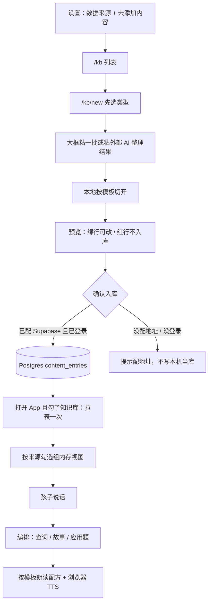
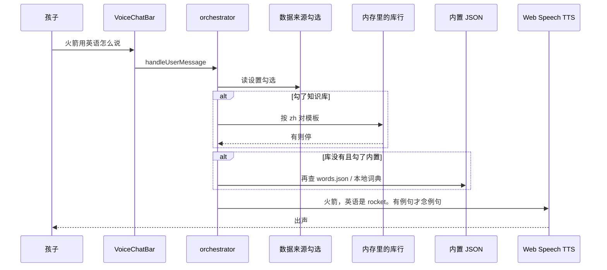

# 知识库方案（先设计，未实施）

> 状态：**方案已审；界面按第 20 节开工。** 设置来源勾选、`/kb` 粘贴预览已做。云库写入仍待配 Supabase。  
> 已定：Postgres + 模板 + 分批粘贴 + 外部 AI 只在入库前 + 谨慎扩展 + **设置双勾数据来源**。

---

## 1. 你要解决的事（用你的话对齐）

现在英语、语文、数学等内容是**写死在安装包里的**（`src/data/*.json`，打包进 JS）。没收录的词/故事/题，只能改代码再发布。

你要的是：

1. 有一个**库**（你心里的「数据库」）
2. **你往库里加**内容（单词、故事、应用题……）
3. **App 去读这个库**，学习页/语音查词跟着变
4. **不用为了加内容去编译代码**

这和「家长在孩子手机设置里导入一个 JSON 文件」不是一回事。  
也和「Service Worker」不是一回事。

---

## 2. 背景硬约束（必须带着想）

| 事实 | 意味着什么 |
|------|------------|
| 线上是 **GitHub Pages 静态站** | 没有自己的服务器，**没有地方接收「保存」请求** |
| `output: "export"`，无 Next API | 不能在本仓库里开 `/api/save` 当数据库 |
| 已经有 `deploy.yml`：push `main` → 自动发布 | 「和 GitHub 挂钩的自动化」已经存在，但是**发布网站**，不是**写入数据库** |
| 内容现在是 `import json` | 改 `src/data` = 必须重新 `next build`，这就是痛点 |
| 孩子用手机 Chrome，语音优先 | 加内容的人是**家长/你**，不是一年级自己填 JSON |
| 你提过：免费、最好不另开一堆云 | 和「我要一个真数据库」是冲突的，必须二选一说清楚 |

**结论：**  
「加到数据库 → App 读库」成立，必须先有一个**大家都能读、你能写**的地方。  
Pages 本身**只能读文件，不能当你的写库**。  
Service Worker **不能当这个库**。

---

## 3. Service Worker 是什么、为什么不当库

Service Worker 是浏览器里的**缓存代理**：网页请求先经过它，用来离线、加速。

| 它能做 | 它不能做 |
|--------|----------|
| 把已经下载的词库缓存在手机里 | 当你在家「往库里加一条」，别人的手机不会知道 |
| 弱网时仍能打开上次的内容 | 没有「表、行、权限、全网一份数据」 |
| 配合 IndexedDB 做离线副本 | 不是 MySQL / 不是后台 |

**不当选。** 方案里最多把它当「读库之后的离线缓存」，第三层，不是第一层。

本机 `localStorage` / IndexedDB 同样只是**这台手机的抽屉**，换手机就没了。不能冒充「项目数据库」。

---

## 4. 三条真路（只能选一条当「主库」）

### 方案 A — GitHub 文件当库（免费、不新开云、和现有流水线一致）

**库是什么：** 仓库里的内容文件，例如单独目录 `content/`（**不要**再打进 `src/data`）。  
**你怎么加：** 在 GitHub 网页改文件，或以后做独立「后台页」用 GitHub Token 提交（Token 不能写进孩子 App）。  
**App 怎么读：** 打开网站时 `fetch('/content/pack.json')`，和代码包分开。  
**自动化：** 你已经有了——改文件 push `main` → Actions 发布 → 全网读到新内容。改的是 `public/content/` 时，甚至可以做到**几乎只更新数据文件**。

优点：0 元、0 新账号、和「GitHub 关联自动化」对得上。  
缺点：GitHub 网页改 JSON **不像填表**；要填表，还得做后台 + Token，有安全成本。  
适合：你能接受「像改文档一样改内容」，或接受以后再做简单后台。

### 方案 B — 免费云数据库（这才是你说的「加到数据库，你去读」）

**库是什么：** 一张（或几张）真正的表，例如 Supabase（Postgres，免费档）或 Cloudflare D1。  
**你怎么加：** 后台网页填表 → `INSERT`。孩子 App **只读、不写**。  
**App 怎么读：** 启动时拉表（或拉一个汇总 JSON），写入手机 IndexedDB，之后离线也能用。  
**自动化：** GitHub 继续只负责发网站；内容生命周期在数据库，不跟每次编译绑死。

优点：心智模型和你说的完全一致；表单好做；换手机也能读同一份库。  
缺点：这就是**云服务**（免费档也是云）；要注册、要管 Key；Key 只能「匿名只读」，写权限绝不能放进前端。  
适合：你明确要「填表入库、全网立刻有」。

免费档够用的量级：几千条词 + 几十个故事，远超一年级内容。

### 方案 C — 继续写死 + 大改 `src/data` 再发版

就是现状。加一条就要开发打包。**否决**，这正是你要甩掉的。

---

## 5. 推荐（结合背景，不是再问一句做一句）

**主库选 B，具体引擎用 PostgreSQL（托管在 Supabase 免费档），字段用 JSONB。不要自建 MySQL，也不要先上 Mongo。**

缓存：IndexedDB。Service Worker 可选、只缓存。  
填表：就在当前 Web 里，设置页一个入口 → 跳到填表页（先简单做）。

选型理由见下一节。若坚持一个云账号都不开：只能退回 A（GitHub 文件），那就不是数据库。

---

## 6. 整体怎么转（拍板后才做）

```
乱七八糟的原文（手贴 / 以后 OCR）
    │ 可选：复制提示词，丢给豆包/Kimi 等「别的 AI」
    │       让它按模板整理（不在 Bella 里藏 Key）
    ▼
按模板切开 / 填格 → 预览（人确认）
    ▼
Postgres：一行 = 一份填好的模板（payload）
    │ 打开 App 拉一次
    ▼
按同一套模板朗读 / 判题
    │ 必填格：原样
    │ 选填格（例句、讲解、追问）：有就读，没有用固定短句，不现场编故事
```

内置 `src/data/*.json` **保留**，但是否参与学习由设置里的「数据来源」决定（第 18 节）。  
不是写死「永远库优先」——只勾内置就完全不读库；只勾知识库就不读安装包。

GitHub Actions **继续只发网站**，不负责往库里灌数据。

---

## 7. 库表怎么设计（一张表就够起步）

表名：`content_entries`

| 字段 | 含义 |
|------|------|
| id | 自动 |
| kind | `word` / `story` / `word_problem` / `joke` / `poem` / `hint` |
| payload | JSON：不同 kind 字段不同 |
| locale | 默认 `zh` |
| enabled | 上架/下架 |
| updated_at | 排序、增量拉取 |

`payload` 示例：

- word：`{ "zh": "火箭", "en": "rocket", "sentence": "A rocket flies." }`
- story：`{ "title": "小熊猫找妈妈", "text": "……" }`
- word_problem：`{ "question": "……", "answer": 6, "explain": "4+2=6", "emoji": "🐼" }`
- joke：`{ "text": "……" }`
- hint：`{ "section": "english.words", "text": "可以说……" }`

先一张宽表，避免一上来拆 8 张表。一年级内容量撑不住过度设计。  
**`payload` 必须符合下面第 17 节的模板。** 不合模板的不入库。模板是切开、预览、朗读共用的合同，要先写死再写代码。

---

## 8. 表单怎么设计（先简单：设置里一点，再跳去填）

按你说的做，不另开一个网站：

```
设置
  └─ 一块「知识库」
        [去添加内容]     ← 唯一入口，字大、好点
        已添加 N 条
            ↓ 跳转
/kb          列表（可空）
/kb/new      先选类型 → 大框粘一批 → 预览 → 确认入库
```

第一期只做这一条路径。列表页能看、能下架、能改一条即可。不在设置页塞满输入框。

### 写进去怎么才实用（结论先说）

**不要一个个填表。也不要把一整页字混着扔进去让网上猜。**

实用做法是 **分着粘**：你已经知道这批是单词还是故事还是题，先点类型，再把这一批贴进一个大框。手机按规则切开，你看一眼预览，点确认，才进 Postgres。

| 想法 | 为什么不实用 | 我们怎么做 |
|------|--------------|------------|
| 十个词填十次表单 | 家长做不到，功能等于摆设 | 表单只留给「改错 / 补一条」 |
| 课文、单词、题混成一坨全粘 | 免费规则拆不准；交给网上 AI 要钱还会编 | **分粘**：这一批只选一种类型 |
| 拍照识别完自动进课堂 | 识错一个答案，孩子就会被判错 | 识别结果仍进同一个框，**你确认才入库** |
| 整页乱字交给模型分类改写 | 要 Key、不稳、一年级不能瞎编 | **不做** |

家长口令四位可选，避免孩子乱提交。

### /kb/new 主路径：选类型 → 粘一批 → 预览 → 入库

1. 先点这一批是什么：单词 / 语文 / 故事 / 应用题 / 笑话  
2. 默认一个大输入框：微信笔记、备忘录、OCR 出来的字，都往这里贴  
3. 点「拆开预览」：在手机里按规则拆成几条（**不打任何付费接口**）  
4. 预览里能改错行、丢掉某行；拆不开的行标红，不入库  
5. 点「确认入库」才 `INSERT`。必填格原样入库；选填格（例句/讲解）空着也可以，留给外部 AI 或以后补  
6. 旁边留「只加一条」：改错字、补漏的一个词。单条表单的格子 = 该类型模板的字段

### 粘贴格式（宽松，人能写、机器能拆）

不要求你背语法。常见写法都认；认不出就标红，不偷偷猜。

**单词**（一行一条）。中英顺序都行；中间用空格、逗号、顿号、冒号都行：

```
火箭 rocket
rocket 火箭
书本, book
飞船：spaceship A spaceship is fast.
```

第三段英文当作例句（选填）存下来。没写例句：库里为空，朗读用固定短句「火箭，英语是 rocket」，**不现场造新句子**。

**故事**：一篇就贴标题 + 空行 + 正文。多篇用单独一行 `---` 隔开。没有标题就用正文前几个字当标题，仍整篇原文入库。

**应用题**（一行一题，**最后一个数字是答案**）：

```
小明有 2 个苹果，又拿到 1 个，一共几个？ 3
竹林里有 4 只熊猫，又来了 2 只，一共几只？ 6
```

题干里的 `2`、`1` 不是答案；只取行末那个数。没有行末数字 → 标红，不入库。

### 孩子怎么用到

还是说话：查词 / 讲故事 / 应用题。先查库，没有再用内置 187 词。孩子不用懂「知识库」。

---

## 9. App 读取策略

1. 启动：请求主库（超时 3s）
2. 成功：写入 IndexedDB，记下 `updated_at`
3. 失败：用 IndexedDB 上次副本；再没有用内置 JSON
4. 学习/查词只读「按数据来源勾选算出来的内存视图」，不在语音热路径上打网
5. Service Worker（若做）：只缓存这次 GET，**不在 SW 里接受「加一条」**

这样弱网、无网都不炸；和现有「词典不进错误页」原则一致。

---

## 10. 和现有模块怎么接（实施时才改这些文件）

| 模块 | 现在 | 接上库之后 |
|------|------|------------|
| 查词 | `local-dictionary.ts` + `words.json` | 按第 18 节来源勾选合并 |
| 单词卡 | `word-pool.ts` | 同上 |
| 故事/笑话 | `local-content.ts` | 同上 |
| 应用题 | `chinese-content.ts` | 同上 |
| 古诗 | `poetry.ts` | 同上（第二期 kind） |
| 语音 hint | `voice-hints.ts` | 只提示当前来源里真有的说法 |

设置页两块：①「数据来源」双勾 ②「去添加内容」。填表在 `/kb/new`，写云库。前面 PR 的导入/本机填表，实施时删掉，避免两套库。

---

## 11. 明确不做

- 不在 GitHub Pages 上假装有服务器数据库
- 不用 Service Worker 当主库
- 不把数据库写 Key 放进 Bella 前端
- 不让一年级在设置里粘贴 JSON
- 不为加内容再走 Flutter / 新后端框架
- 不把 LLM 当知识库

---

## 12. 数据库选型（MySQL / Mongo / 业界常用免费档）

你问的是：后台库用 MySQL 这种表，还是 Mongo 这种文档。结合「知识内容 + 以后拍照识字入库 + 免费、常用、稳」，结论如下。

### 不自建 MySQL

MySQL 本身很稳，但要一台一直开着的服务器（VPS）装库、备份、证书。本项目是 GitHub Pages，**没有这台机器**。为了知识库去租服务器，贵、碎、和「免费」不符。业界做小型 Web 内容库，2024–2026 也不会从零搭 MySQL。

### 不先上 MongoDB

知识条形状不固定（单词一块、故事一块、以后 OCR 又一堆字），文档库看起来合适。但：

- MongoDB Atlas 免费档只有库，**没有**现成的登录、文件桶
- 以后照片/PDF 还要再接一套 Storage
- 查询、权限、备份要自己拼

文档灵活性能用 Postgres 的 **JSONB** 列拿到，不必为这个上 Mongo。

### 业界通用、免费、健康的做法：Postgres + JSONB（Supabase 托管）

这是独立站 / Next 小产品现在最常见的一条龙：

| | Supabase（Postgres） | Firebase Firestore | Mongo Atlas |
|--|--|--|--|
| 库类型 | 关系库 + JSONB（半文档） | 纯文档 | 纯文档 |
| 免费档（量级，以官网为准） | 库约 500MB、文件约 1GB、Auth | 有免费档，读写按次容易超 | 库约 512MB，无全家桶 |
| 以后照片 | 自带 Storage | 自带（规则另学） | 要另接 |
| 以后 OCR 文本 | 丢进 JSONB 即可 | 丢进 document | 丢进 document |
| 锁死程度 | 低（标准 Postgres，能搬走） | 高 | 中 |
| 和本项目 | 静态站直接用官方 JS 读写 | 也能，但计费和锁死更烦 | 只解决「表」不够 |

**一句话：选 Postgres，不要选「像 Mongo 那样的库」当第一期。**  
JSONB 就是「表里的文档格」：`kind` 用列筛，细节放 `payload`。单词、故事、以后识别出来的一段字，都能塞，又不用上 Mongo。

Supabase 免费档会闲置暂停（大约一周没访问），第一次打开可能慢几秒，对这个体量可接受。不要绑银行卡除非你自己要升级。

### 表还是只要一张（给以后留口）

`content_entries` 不变。以后拍照/文件多了，再加一张 `content_assets`（文件地址、识别原文），**现在不要建**。

---

## 13. 以后怎么发散：拍照、识字、文件 → 分类进库

第一期只做填表。下面是预留，避免选错库之后推翻。

```
相机 / 相册 / PDF、Word
    → 文件进 Supabase Storage
    → 识别出一段字（浏览器 OCR 或后续云识别）
    → 粗分类 kind：word / story / word_problem / joke / other
    → 人点一下确认（不能全自动乱进学习页）
    → 写成 content_entries 一行
```

- **分类（你说的分门别类）** 是写入前的一步，不是 Service Worker 的事
- 识别错了必须能改 kind、改正文再保存
- 照片本身不进 Postgres 大字段，进 Storage，表里只存地址 + 识别文
- 第一期表单底部可以留灰按钮「拍照添加（下期）」，避免以后另起一页

选 Postgres+Storage，这条路不用换库。若第一期选 Mongo，后面还是要再找地方放照片。

OCR / 文件识别的结果**倒进同一个粘贴框**，后面拆开、预览、入库与手贴完全一样。不要为识别另做一套「自动进学习页」。

---

## 14. 写进去、读出来（这是功能能不能用的关键）

下面按你问的三件事说清楚：**表单还是粘贴、识别后怎么进库、读的时候加不加工。**

### 14.1 你怎么写进 Postgres

不是一辈子填表，也不是把一页书扫完就自动变课。

**主路径 = 分着粘 + 预览确认。**

家长真实流程（免费、两分钟能加完一课单词）：

1. 打开设置 → 去添加内容 → 点「单词」  
2. 从课本、微信、备忘录把这一课的词一次性贴进大框（或以后拍照识别，字仍进这个框）  
3. 看预览：`火箭 → rocket` 对不对；错行改掉，垃圾行丢掉  
4. 确认入库 → 表里多了几行 `kind=word` 的 JSONB  
5. 故事、应用题另开一批再贴，**不要和单词混在同一次粘贴里**

| 做法 | 实用吗 | 采用 |
|------|--------|------|
| 一条一条填表 | 改错、补漏可以；加一课单词会放弃 | **辅** |
| 先选类型，再粘这一批，预览后入库 | 一次十几个词 / 几道题，免费、可控 | **主** |
| 拍照/文件识别 → 进同一框再预览 | 少打字；识错仍能改 | **第三期** |
| 单词+故事+题混成一坨全粘，让机器分类 | 免费规则会拆错；网上 AI 要钱还会编 | **不做** |
| 整页乱字交给网上模型改写成课程 | 要 Key、会编、答案可能变 | **不做** |

**写入原则：确认后，必填格存啥是啥；选填格可以空，也可以在入库前用别的 AI 按模板补上。**  
Bella 自己只做切开和校验，**不在 App 里调大模型**。不合模板的行标红，不入库。

第三期 OCR 也一样：识别只负责「变成字」，不负责「变成课」。字进同一个框，仍按模板切开、预览。

### 14.2 读出来是怎样——按模板念，谨慎扩展

孩子说话之后仍是三步，**不在听的时候联网改写**：

```
打开 App     → 联网只拉表（或缓存 / 内置兜底）
孩子说一句   → 本地对上哪一行
朗读 / 判题  → 按该类型的「朗读配方」填模板格子
```

| 格子 | 读的时候 |
|------|----------|
| 必填（中文、英文、题干、答案、故事正文） | **原样**。`rocket` 就是 rocket，答案 `6` 就按 6 判，正文不续写 |
| 选填已填（例句、讲解、听完追问） | **读出来**。这就是「不那么死板」的正路：扩展写在库里，不是现场编 |
| 选填空着 | 只用**固定短句**（见第 17 节配方）。不调用模型造句、不改答案 |
| 库里根本没有这一条 | 走现在的内置词/故事/本地词典。不拿模型现场写一篇「火箭的故事」 |

对照：

| 你问的 | 结论 |
|--------|------|
| 先写模板再按模板切 | **对，必须先写。** 见第 17 节 |
| 入库前用别的 AI 转成模板 | **能做，而且该做。** Bella 不调 AI，你把提示词复制到豆包/Kimi |
| 读的时候联网加工再读 | **不做**。慢、要 Key、会改答案 |
| 完全不扩展、念完就停 | 太死板。用选填格 + 固定短句，不现场编 |
| 无条件发散扩写 | **不做**。一年级题会被改错 |

### 14.3 怎样才算功能实用（验收，不是口号）

免费要做到「能用」，用这几条卡：

1. **家长能加完一课**：从笔记复制 15 个词，预览一次，确认，不必填 15 次表。  
2. **孩子当天能问到**：加完「火箭 rocket」后，说「火箭用英语怎么说」，听到的就是 rocket，不是超时、不是编的别的词。  
3. **错了能改**：预览标红、列表里改一条、下架一条；改完再拉表就是新原文。  
4. **来源可预期**：只勾内置 = 和现在一样；只勾知识库 = 只用库（连不上就说连不上，不偷换内置）；两个都勾 = 先库后内置。  
5. **不花 Bella 的内容钱**：拆行、校验、TTS、判题不走付费模型。你自己用别的 AI 整理模板，算你的免费额度，Key 不进本仓库。

做不到第 2、3 条，填表做得再漂亮也不算知识库。

### 14.4 智能放在哪

「贴完 → 网上理解 → 再读给孩子听」仍然不做：要 Key、会改答案、弱网更慢。

智能只放在 **入库之前、人还能改的那一步**：按模板切开；可选地用外部 AI 填选填格；你预览后再进库。孩子听的时候只填模板，不再思考。

---

## 15. 实施顺序（拍板后才开工）

1. **先把第 17 节模板落成代码合同**（TypeScript 类型 + 切开函数 + 朗读配方）。不合模板不入库。
2. 开 Supabase 免费项目，建表；anon 只读；写入用家长口令（Key 不进 Git）
3. 设置页：数据来源双勾（第 18 节）+「去添加内容」
4. `/kb` 列表；`/kb/new`：选类型 → 粘一批（或粘外部 AI 整理结果）→ 按模板预览 → 确认
5. 页上提供「复制给 AI 的提示词」（Bella 不调模型）
6. 学习/查词按来源勾选组内存视图，再按模板朗读
7. 再 IndexedDB（只勾知识库、没网时用上次成功拉到的副本）
8. 再以后 OCR 倒进同一框

没说「按这个实施」之前：**不改产品代码。**

---

## 16. 当前默认

| 项 | 默认 |
|----|------|
| 主库 | Supabase / Postgres + JSONB（免费档） |
| 合同 | **先写死模板**（第 17 节），切开和朗读都按它 |
| 写入 | 分着粘 → 按模板切开 → 预览确认；单条表单 = 填同一套格子 |
| 外部 AI | 入库前可选：复制提示词到豆包/Kimi 等，**Bella 不调 API** |
| 读出 | 必填原样；选填有就读；选填空用固定短句；**不在听的时候联网扩写** |
| 扩展 | 有条件、谨慎：只填空的选填格，永不改答案/英文词 |
| 不选 | 一条条填表当主路径、混粘靠 AI 分类、孩子说话时送上网加工 |
| 数据来源 | 设置里双勾：内置 / 知识库；都不能空；都勾则先库后内置（第 18 节） |
| 出厂默认 | **只勾内置**。库里有内容后，建议改成两个都勾，不默认「只知识库」 |
| 入口 | 设置 → 数据来源 + 去添加内容 → `/kb/new` |
| 离线 | 第二期 IndexedDB（只勾库时的上次副本） |
| 拍照识字 | 第三期，结果进同一粘贴框 |

没说「按这个实施」之前：**不改产品代码。**

---

## 17. 模板、外部 AI、谨慎扩展（这次问的三件事）

你的理解对了一大半，这里对齐并写死：**能不能做成、做成什么样。**

### 17.1 是不是「先写模板，再按模板切」？

**是。而且必须先写。**

库里存的不是一篇随便的文章，是「填好的表格」。拉的时候按格子拼朗读，不是把一坨字再理解一遍。

所以实施时第一件事不是开数据库，是把下面这套模板写成代码合同：

- 粘贴切开 → 填这些格子  
- 预览 / 单条表单 → 还是这些格子  
- 入库 `payload` → 还是这些格子  
- TTS / 判题 → 按「朗读配方」读这些格子  

不加模板、只靠「感觉切开」，语义不连贯、拆错行、朗读东一句西一句，后面全是补丁。

仓库里已经有一份接近的形状：`src/lib/kb/types.ts`（`KbWord` / `KbStory` / `KbWordProblem`）。正式接库时以本节为准，和现有学习页字段对齐，避免两套结构。

### 17.2 第一期模板（先全部写出来）

先做单词、语文汉字、故事、应用题、笑话。古诗、hint 以后再加。

**单词 `word`**（和单词卡、查词对齐）

| 格子 | 必填 | 谁能改 | 说明 |
|------|------|--------|------|
| `zh` | 是 | 只有人 | 中文词，如 火箭 |
| `en` | 是 | 只有人 | 英文词，如 rocket。**扩展不能换成别的词** |
| `sentence` | 否 | 人，或入库前外部 AI | 一句例句 |

朗读配方（孩子说「火箭用英语怎么说」）：

1. 念：`{zh}，英语是 {en}。`  
2. 若有 `sentence`：再念 `sentence`  
3. 若无：停。不造 `A rocket flies to the moon` 这种新句  

**语文汉字 `hanzi`**（和语文认字卡对齐）

| 格子 | 必填 | 谁能改 | 说明 |
|------|------|--------|------|
| `char` | 是 | 只有人 | 一个汉字，如 天 |
| `pinyin` | 是 | 只有人 | 拼音，如 tiān |
| `words` | 是 | 只有人 | 组词，如 天空、天气 |
| `sentence` | 否 | 人，或入库前外部 AI | 一句例句 |
| `emoji` | 否 | 人 | 没有就用 📝 |

粘贴一行一条：`天 tiān 天空、天气 今天天气真好。`

朗读配方：念「`char` 读 `pinyin`。组词：`words`。`sentence`」

**故事 `story`**

| 格子 | 必填 | 谁能改 | 说明 |
|------|------|--------|------|
| `title` | 是 | 只有人（AI 可建议，人点确认） | 标题 |
| `text` | 是 | 只有人。**朗读不续写、不缩写** | 正文 |
| `followup` | 否 | 人，或入库前外部 AI | 听完追问，如「熊猫最后找到妈妈了吗？」 |

朗读配方：念 `《{title}》` + `text`；若有 `followup` 再问一句；没有就说「讲完了，要不要再听一遍？」

**应用题 `word_problem`**

| 格子 | 必填 | 谁能改 |
|------|------|--------|
| `question` | 是 | 只有人 |
| `answer` | 是 | **只有人。任何 AI、任何扩展都不能改这个数字** |
| `explain` | 否 | 人，或入库前外部 AI（必须仍等于这个答案） |
| `emoji` | 否 | 人 |

朗读配方：念 `question`；判 `answer`；对了且有 `explain` 再念讲解；没有讲解只说「对了！」

**笑话 `joke`**

| 格子 | 必填 |
|------|------|
| `text` | 是（或 `q` + `a` 两格，入库时拼成 `text`） |

朗读配方：整段念完。不扩展包袱。

不合模板（单词缺英文、应用题没有行末数字、故事正文空）→ 预览标红，**不入库**。

### 17.3 入库前用「别的 AI」转成模板——能做，这样最实用

你说的「插入库的时候用其他 AI 软件加工，转成类似模板，语义会好一点」——**对，而且放在写入侧才安全。**

Bella 是静态站，不能、也不该在前端藏模型 Key。做法是 **人当搬运工，模板当验收**：

```
你复制页上的「整理提示词」+ 这一批原文
    → 粘到豆包 / Kimi / ChatGPT（你自己的号，免费额度）
    → 它按模板吐出一行一行
    → 粘回 /kb/new
    → Bella 按模板校验、预览
    → 你改红行、确认入库
```

页上固定提示词必须带**输入例子和输出例子**，不能只写规则。复制出去的提示词里已经写好「火箭 rocket → 火箭	rocket」这类对照。

应用题提示词必须加一句：**答案数字必须和原文一致，不准改。**  
笑话提示词必须写清：整段当笑话，不要拆成单词。

这样：

- 语义整理发生在 **进库之前**，你还能改  
- 孩子听的时候 Bella **不再调用任何 AI**  
- 全部免费：整理用你已有的 AI 软件；Bella 只做切开、校验、TTS  
- 不识别 / 语义不连贯：先丢给外部 AI 填模板，再预览；仍不对就手动改那一行（改的是模板格子，不是再填一张无关的表）

Bella **第一期不内置「一键发给模型」**。以后若要一键，必须单独的家长页 + 你自己的 Key，不进 Git、不进孩子语音热路径。

### 17.4 要不要基于原文发散？要，但必须有条件

完全不扩展会死板（只有 `火箭 rocket` 四个字就停）。无条件扩展会把应用题改错、把故事讲歪。

**能实现。条件写死如下。**

| 条件 | 为什么 |
|------|--------|
| 只填 **空的选填格**（`sentence` / `explain` / `followup`） | 不覆盖你已经写好的原文 |
| **永不改** `en`、`answer`、故事 `text` | 查词和判题是硬事实 |
| 扩展优先发生在 **入库前**（外部 AI + 预览） | 错了你能看见、能删 |
| 孩子听的时候 **不联网扩写** | 慢、贵、会改意思；弱网还会再超时 |
| 选填仍空时，只用第 17.2 的固定短句 | 不那么死板，也不编新知识 |
| 应用题讲解若由 AI 补：必须验算仍等于 `answer`，人确认 | 补错讲解比不讲更糟 |
| 家长可关「读选填」 | 只要原文时，只念必填格 |
| 孩子说「再讲细一点」 | 只读已存的 `explain` / `followup` / `sentence`；没有就说「库里没有更细的」，**不现场编** |
| 库里没有这一条 | 若勾了内置：用安装包/本地词典。没勾：说没有。不是「发散写一篇」 |

不允许的扩展（做不到「谨慎」就别做）：

- 把 `rocket` 换成 `missile`  
- 把答案 `6` 改成别的数  
- 听故事时让模型续写一段  
- 把一页混杂原文交给模型自动分类进课堂、无人预览  

### 17.5 能不能做成？结论

**能做成，而且比「App 里每次说话都调 AI」更适合咱们（免费、静态站、一年级）。**

| 想法 | 能不能做 | 怎么做 |
|------|----------|--------|
| 先写模板再按模板切 | 能 | 第 17.2 节就是合同；实施第一步写成 TS + 切开函数 |
| 手贴按模板切 | 能 | 规则切开，免费 |
| 外部 AI 先整理成模板再贴回来 | 能 | 复制提示词，Bella 只校验 |
| Bella 里藏 Key、入库时自动调模型 | 第一期不做 | 和「全部免费、Key 不进前端」冲突 |
| 朗读按模板拼，选填有就读 | 能 | 现有 Web Speech，不另接语音 |
| 听的时候谨慎扩写（模型现场编） | 不做 | 无法保证答案和用词 |
| 听的时候固定短句 + 已存选填 | 能 | 这就是「有条件扩展」的免费实现 |

验收（补在 14.3 后面一起用）：

- 只贴 `火箭 rocket`，孩子听到「火箭，英语是 rocket」，不编例句。  
- 外部 AI 补了例句并经你确认，孩子能听到那句例句。  
- 应用题答案未被任何整理步骤改掉。  
- 关掉「读选填」后，只剩必填原文。

---

## 18. 数据来源（设置里勾选，必须有）

现在 App 里用的是安装包写死的 `src/data/*.json`。接上库之后，**不能偷偷永远先读库**，也不能偷偷永远只用内置。你说得对：设置里要能看见、能勾，孩子听到的才可预期。

### 18.1 界面（设置页一块「数据来源」）

两个勾选，**不是单选**：

```
□ 内置     现在系统里的词、故事、题（安装包）
□ 知识库   你添加到数据库里的内容（已上架 N 条）
```

底下固定一行字：

> 两个都勾：先用知识库，没有的再用内置。  
> 至少勾一个。

旁注：上次拉库成功/失败、N 条。点「去添加内容」仍去 `/kb`。

改来源建议走家长口令（和写入同一套），避免孩子把内置全关掉后说「什么都没有」。

这个勾存在**这台手机**（localStorage），不是库里的一行。换手机要再勾一次。库是全网一份，来源是这台设备的偏好。

### 18.2 四种组合

| 内置 | 知识库 | 行为 |
|------|--------|------|
| ✓ | | 和现在完全一样，**不请求数据库** |
| | ✓ | 只用库里已上架的行。库没有的词/故事/题就说没有，**不偷用安装包** |
| ✓ | ✓ | **先知识库，再内置**（默认推荐，一旦库里有货） |
| | | **不许保存**。两个都空 = 没课。自动勾回「内置」并提示 |

出厂：**只勾内置**。库还没配、一条都没有时，不要默认勾知识库，否则一打开就是空的。  
库里第一次成功入库之后，设置页提示「要不要把知识库也勾上」；点一下变成两个都勾。不自动改成「只知识库」。

### 18.3 「先知识库，再内置」具体怎么漏

「漏」= 先取库，取不到再取安装包。按动作分开，避免随机课被 187 个内置词淹没。

**点名（查这个词、讲这个标题）**

1. 勾了知识库：在库里按模板格子对（`zh` / `en` / `title`）  
2. 对上了：只用这一行，**即使内置也有「火箭」**  
3. 没对上，且勾了内置：再查安装包 / 本地词典  
4. 还没有：说没有。维基百科是第三层「开放查词」，**不受这两个勾控制**（见 18.5）

去重键：单词看 `zh`（同一中文以库为准）；故事看 `title`；应用题看 `question` 全文。库覆盖内置，不把两份都念一遍。

**随机（讲个故事、换一篇、出一道应用题）**

1. 勾了知识库，且该类型库里 ≥1 条：只从库里抽（家长刚加的故事不会被内置挤掉）  
2. 该类型库里是 0 条，且勾了内置：才从安装包抽  
3. 只勾知识库、该类型 0 条：说「知识库里还没有故事，去添加，或把内置勾上」——**不偷换**

**单词卡 / 测验一批（例如 20 个）**

1. 先把库里该类全部排进去  
2. 不够 20 且勾了内置：用内置补，跳过已被库覆盖的中文  
3. 只勾知识库且库里只有 3 个词：这一批就 3 个，不强行凑 20

**种类不齐**：库里只有词、没有故事。两个都勾时——词先走库，故事走内置。只勾知识库时——词能用，故事走空态。不要要求一次把四种都灌满。

下架（`enabled=false`）的行不参与以上任何一步。

### 18.4 勾了知识库但库连不上

和「数据来源要可预期」一致：**不因为失败就偷偷改回内置**（那等于设置骗人）。

| 情况 | 只勾知识库 | 两个都勾 |
|------|------------|----------|
| 拉库成功 | 只用这批行 | 先这批，再内置 |
| 拉库失败，有上次缓存（第二期 IndexedDB） | 用缓存，并提示「现在是上次的库」 | 缓存优先，再内置 |
| 拉库失败，没有缓存 | 说「知识库连不上」，学习页空态 + 建议勾内置 | **只用内置**，并提示「库连不上，先用内置」 |

两个都勾 + 库失败 + 无缓存时用内置，不是偷换来源，是「先库后内置」里库这一层空了。  
只勾知识库 + 失败 + 无缓存：宁可空，也不装成内置——否则你无法知道开关有没有生效。

Supabase 免费档大约一周没人访问会暂停，第一次打开可能失败几秒。设置里要能看见「库连不上」。

### 18.5 这两个勾不包含什么

| 东西 | 算哪一层 | 谁控制 |
|------|----------|--------|
| `src/data/*.json`、本地词典 | **内置** | 「内置」勾 |
| Postgres 已上架行 | **知识库** | 「知识库」勾 |
| 维基百科 / 一言等联网开放内容 | **第三层** | 不进这对勾。以后可另做「允许联网查词」，第一期保持现状 |
| 固定短句（「英语是…」「讲完了」） | 朗读配方 | 不是内容源 |

### 18.6 切换之后立刻生效

不用重新发版、不用重启安装。改勾选 → 重算内存视图 → 下一句语音/下一屏学习页就按新来源。  
刚勾上知识库、这台手机还没拉过表：立刻拉一次，超时规则同第 9 节。

### 18.7 验收

- 只勾内置：断网也能学现在的 187 词；网络里不应出现对 Postgres 的请求。  
- 只勾知识库、库里有「火箭」没有「苹果」：火箭能查到，苹果说没有（即使安装包有苹果）。  
- 两个都勾、两边都有「火箭」但英文不同：只念库里的英文。  
- 两个都勾、库里没有故事：讲故事用内置。  
- 两个都不勾：保存失败，仍是内置。

---

## 19. 整份方案复盘（过一遍还剩的问题）

把写入、模板、扩展、数据来源串起来之后，下面这些是**还没堵死、实施前必须认**的洞。不是再开一堆功能，是避免做成了不能用。

### 已经对齐、可以当合同的

1. 主库：Supabase Postgres + JSONB，一张 `content_entries`。  
2. 写入：分着粘 → 按模板切开 → 预览确认；单条表单只改格子。  
3. 模板先写死（第 17.2 节），不合模板不入库。  
4. 外部 AI 只在入库前、用你自己的软件；Bella 不藏 Key。  
5. 朗读：必填原样，选填有就读，空则固定短句；听的时候不联网扩写。  
6. 数据来源：设置双勾，都勾则先库后内置；出厂只勾内置。  
7. 孩子语音入口不变：查词 / 讲故事 / 应用题。

### 必须正视的洞（不补会重演 TTS 空 URL）

**1. 知识库地址怎么进 GitHub Pages**  
家长照 [`KB_SETUP.md`](./KB_SETUP.md) 申请并填 GitHub Secrets。构建时必须注入 `NEXT_PUBLIC_SUPABASE_URL` + `NEXT_PUBLIC_SUPABASE_ANON_KEY`（anon 本就是公开只读）。**不配地址时不能入库，也不要打到空路径干等。** 不要把 `service_role` 写进 Bella。

**2. 谁有权写入（四位口令不够）**  
站点是公开的，anon key 也会在网页里。若 RLS 允许匿名 `INSERT`，网上任何人都能往你库里灌垃圾。四位口令只防孩子误触，防不了陌生人。  
第一期可行、仍免费的写法：家长用 **Supabase 邮箱登录** 才能进 `/kb/new`；RLS 规定只有登录用户能写，anon 只能读 `enabled=true`。口令是第二道（防孩子碰到已登录的手机）。不要把 `service_role` 写进 Bella。

**3. 只勾知识库时的空窗**  
库未配、库为空、免费档暂停、没网且还没有 IndexedDB——孩子会面对空课。所以：出厂只勾内置；空库不允许只留知识库（设置里警告并建议勾上内置）；IndexedDB 要在鼓励「只知识库」之前做。

**4. 种类不齐是常态**  
你会先加词、后加故事。合并必须按 **kind 分别**漏，不能「库里有任何一条就把内置整包关掉」。第 18.3 节已写，实施时每个 provider 都要按 kind 判断，不能写一个全局 `if (kb.length) skipBundled`。

**5. 两套库会打起来**  
设置页 JSON 导入已删。只留 Postgres + 数据来源勾选。孩子手机 localStorage 不当主库（来源勾选本身存在本机，那是偏好不是内容）。

**6. 覆盖键要先定**  
同一「火箭」库里是 rocket、内置若以后也有，以库为准。单词按 `zh`，故事按 `title`。实施时写单测，避免两边各念一遍。

### 第一期故意不做（不是忘了）

- Bella 内置一键调用大模型  
- 听的时候发散续写  
- 混粘一页书自动分类进课堂  
- 拍照 OCR（第三期，结果仍进同一框）  
- Service Worker 当库  
- 自建 MySQL / 先上 Mongo  
- 多孩子多库、按科目分别勾来源（以后要再加，第一期全局一对勾就够）  
- 维基/一言并进「数据来源」双勾  

### 实施时建议的验收顺序（仍等你说「按这个做」）

1. 模板切开 + 预览（可以先不接云，用假数据看格子对不对）  
2. 数据来源勾选 + 合并函数单测（只内置 / 只库 / 双勾 / 空库 / 同词覆盖）  
3. 接 Supabase 只读；写入走登录  
4. 设置页两块 + `/kb/new`  
5. 真机：切换来源后查词/故事/应用题是否跟勾选走  

界面与切开已按本节开工：设置来源勾选、`/kb` / `/kb/new` 预览。**云库写入仍要配 Supabase，未配不写本机当库。**

---

## 20. 流程图与界面（交互 / 调用）

这一节让你看见人怎么点、机器怎么调。界面按这些草图做。

### 20.1 总览：写入一条，孩子听到



### 20.2 孩子说一句话时怎么调用



打开 App：只勾内置则不请求 Postgres。勾了知识库才拉一次表。

### 20.3 设置页

```
┌─────────────────────────────────┐
│  ⚙️ 设置                         │
├─────────────────────────────────┤
│  📚 知识库                       │
│  数据来源（至少勾一个）           │
│  ☑ 内置     安装包里的词和故事    │
│  ☐ 知识库   数据库 已上架 0 条    │
│  两个都勾：先用知识库，没有再用内置 │
│  ┌───────────────────────────┐ │
│  │     去添加内容            │ │
│  └───────────────────────────┘ │
└─────────────────────────────────┘
```

不要再出现：导入 JSON、粘贴 JSON、下载模板、刷新 pack.json。

### 20.4 列表 /kb 与添加 /kb/new

```
/kb                          /kb/new
← 返回设置  知识库            ← 返回列表  添加内容
已上架 N 条                   这一批是：[单词] 故事 应用题 笑话
[ 添加 ]                     ┌ 大框粘贴 ─────────┐
空态：还没有内容               └───────────────────┘
                             [复制给 AI 提示词] [拆开预览]
                             ✓ 火箭 → rocket
                             [ 确认入库 ]
```

### 20.5 三种来源

```
只勾内置    → 187 词 / 现有故事（不拉库）
只勾知识库  → 只念库里的；没有就说没有
两个都勾    → 先库后内置（按类型分别漏）
```
