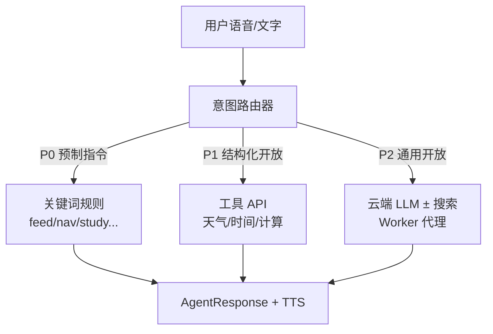

# 开放问答方案：超越关键词的「能聊感」

> 状态：**规划稿**（待评审后实施）
> 关联：[VOICE_UX_PLAN.md](./VOICE_UX_PLAN.md) · [BROWSER_COMPAT_PLAN.md](./BROWSER_COMPAT_PLAN.md) · [ARCHITECTURE.md](./ARCHITECTURE.md)
> 撰写日期：2026-08-30

---

## 1. 问题描述

### 1.1 用户期望

用户问「今天天气怎么样」「现在几点了」「1+1等于几」等**未预制关键词**的问题时，希望 Bella **有实质回应**，而不是：

> 「嗯…我还在学习理解你说的话。试试说「帮助」？」

### 1.2 现状（mock-agent.ts）

```
用户输入 → normalize → 遍历 RULES 关键词 includes 匹配
                              ↓ 未命中
                    DEFAULT_RESPONSES 随机兜底（3 条生硬话术）
```

| 类型 | 现状 | 问题 |
|------|------|------|
| 预制指令（喂食/导航/学习） | ✅ 关键词匹配 | 说法受限，但可用 |
| 弱相关（如「天气」） | ⚠️ 有关键词但**假回答** | 「天气很好呢！不过我更关心单词…」—— 用户感知为敷衍 |
| 完全未知 | ❌ 随机兜底 | 显得「笨」、产品感差 |

### 1.3 核心诉求

> **让人感知到「有响应、有在帮忙查」，而不是「不懂」。**

不要求一开始就做实时天气级精度，但要有**可扩展的开放问答通路**。

---

## 2. 关键结论：能否用「系统自带搜索引擎」？

### ❌ 不能指望浏览器/手机「系统搜索引擎」直接回答

| 误解 | 事实 |
|------|------|
| Chrome 默认搜索引擎是 Google，网站能调它 | **没有**面向网页的「把用户问题交给默认搜索引擎并朗读结果」公开 API |
| 豆包/小爱也是搜索引擎 | 背后是 **云端大模型 + 工具调用**（搜索/天气/日历 API），不是读浏览器设置里的搜索引擎 |
| 静态 GitHub Pages 能免费搜全网 | 搜索/大模型 API 均需 **Key + 后端代理**，Key 不能写在前端 |

### ✅ 可行替代路径



**原则：关键词管「控制」，工具/LLM 管「开放聊」。**

---

## 3. 推荐架构：三层意图路由

### 3.1 路由优先级

| 优先级 | 类型 | 处理方式 | 示例 |
|--------|------|----------|------|
| **P0** | 应用控制指令 | 现有 `RULES` 关键词（保持） | 「去首页」「喂食」「开始学习」 |
| **P1** | 结构化开放问题 | **免费/低成本 API**，浏览器或 Worker 可直连 | 天气、时间、简单计算 |
| **P2** | 通用开放问题 | **LLM**（+ 可选搜索增强）经 Worker | 「为什么天空是蓝的」「讲个笑话」 |
| **P3** | 兜底 | Bella 人设化引导 + 学英语牵引 | 「这个我再去查查，我们先学个单词？」 |

### 3.2 接口改造（由同步变异步）

当前 `processUserInput(input): AgentResponse` 为**同步**，无法 await 网络请求。开放问答需改为：

```typescript
// 规划接口
export async function processUserInputAsync(
  input: string,
  context?: AgentContext
): Promise<AgentResponse>

interface AgentContext {
  city?: string;           // 用户城市（geolocation 或设置页）
  petName?: string;
  level?: number;
  tab?: TabTarget;
}

// VoiceChatBar 调用处
setAgentEmotion("thinking");
const response = await processUserInputAsync(text, ctx);
onAgentResponse(response);
```

**UX 要点：**

- 请求中：Bella 切 `thinking` 表情 + ReplyBar 显示「让我想想…」
- 超时（如 8s）：降级为 P3 兜底话术
- 失败：不静默，明确说「网络不太好，我先…」

### 3.3 与现有模块关系

```
VoiceChatBar
    → processUserInputAsync()
        ├─ rules-engine.ts      // P0 关键词（从 mock-agent 拆出）
        ├─ tools/               // P1 工具
        │   ├─ weather.ts
        │   ├─ datetime.ts
        │   └─ calculator.ts
        └─ cloud-agent.ts       // P2 Worker 调用（可选）
    → handleAgentResponse()     // 不变：emotion / navigate / feed...
    → speak() + VoiceReplyBar
```

---

## 4. 分期方案

### Phase 1 — 结构化工具（零 Key，推荐先做）

**目标：** 天气/时间/计算类问题有**真实数据**，成本为零，纯前端可完成。

| 工具 | API | Key | 说明 |
|------|-----|-----|------|
| **天气** | [Open-Meteo](https://open-meteo.com/) | 免费无需 Key | 浏览器 geolocation 取经纬度 → 查当前天气 |
| **时间** | 本地 `Date` | — | 「现在几点」直接格式化 |
| **计算** | 安全 eval / mathjs | — | 「3乘7」→ 21，需防注入 |

**意图识别（Phase 1 轻量版）：**

```typescript
// 在关键词 RULES 未命中后
if (/天气|气温|下雨|冷不冷|热不热|weather/.test(input)) → fetchWeather()
if (/几点|时间|日期|今天周几|now|time/.test(input)) → getDateTimeReply()
if (/等于|加|减|乘|除|\d+[\+\-\*\/]\d+/.test(input)) → calcReply()
```

**天气回复示例（有真实感）：**

> 「北京现在 26°C，多云，体感挺舒服的~ 出门记得带水哦！学单词前心情也不错吧？」

**局限：** 需用户授权定位；拒绝定位时用设置页默认城市或回复「你在哪个城市呀？」

**工作量：** 小（约 1–2 个工具模块 + mock-agent 改 async + VoiceChatBar loading 态）

---

### Phase 2 — 云端 LLM（Bella 人设 + 通用问答）

**目标：** 任意开放问题有自然回答，仍保持「英语宠物教师」人设。

**架构：**

```
浏览器 → Cloudflare Worker（持有 API Key）
              → 通义千问 / 智谱 / Gemini / Groq 等
              → 返回 { reply, emotion?, suggestStudy? }
```

**System Prompt 要点：**

- 你是 Bella，用户的英语学习宠物伙伴
- 简短口语化，适合 TTS 朗读（≤ 80 字优先）
- 回答后可自然牵引学英语（「对了，『cloud』就是云的意思~」）
- 不编造实时数据；天气/新闻类应走工具而非幻觉

**成本：** 多数模型有免费额度；需注册云账号 + Worker 部署。

**配置：** 设置页「智能对话（实验性）」开关 + `NEXT_PUBLIC_AGENT_WORKER_URL`（与当年 TTS Worker 类似，但走 LLM）。

---

### Phase 3 — LLM + 搜索增强（最接近「查搜索引擎」）

**目标：** 「最新新闻」「某某是谁」类问题，LLM 先 **search tool** 再总结。

```
用户问题 → Worker → LLM function calling
                        ├─ tool: web_search(query)  → Bing/Tavily/SerpAPI
                        ├─ tool: get_weather(city)
                        └─ tool: app_navigate(tab)
                     → 汇总成 Bella 口吻回复
```

| 搜索服务 | 国内可用 | 免费额度 | 备注 |
|----------|----------|----------|------|
| Tavily | 需测 | 有 | AI 场景常用 |
| Bing Web Search | 需 Azure | 有 | 微软生态 |
| Serper (Google) | 需代理 | 有 | 海外友好 |
| 百度搜索 API | ✅ | 试用 | 国内合规 |

**注意：** 搜索 API 也**不是**调用户手机「默认搜索引擎」，而是服务端专用搜索接口；效果上接近「帮你搜了一下再回答」。

---

### Phase 4（可选）— 外链搜索兜底

零成本、体验一般，仅作最后兜底：

```typescript
// 用户问完全无法处理时
reply: "这个问题 Bella 还在学~ 我帮你打开搜索看看？"
action: { type: "open_search", query: userText }
// window.open(`https://www.baidu.com/s?wd=${encodeURIComponent(q)}`)
```

**优点：** 零后端  
**缺点：** 跳出 App、无法 TTS 读结果、体验割裂 — **不建议作为主方案**

---

## 5. 为什么不继续堆关键词？

| 方式 | 天气 | 100 类开放问题 | 维护成本 |
|------|------|----------------|----------|
| 继续堆关键词 | 只能假回复 | 不可扩展 | 线性爆炸 |
| Phase 1 工具 API | ✅ 真天气 | 每类写一个工具 | 中等 |
| Phase 2 LLM | ✅（+工具更好） | ✅ 通用 | 低（Prompt 统一） |

**推荐组合：P0 关键词 + P1 高频工具 + P2 LLM 兜底。**

---

## 6. 天气场景端到端示例（Phase 1）

```
用户：「今天天气怎么样」
  ↓
RULES 未命中（或命中旧规则但改为走工具）
  ↓
intent = "weather" → fetchWeather(lat, lon)
  ↓
Open-Meteo: { temp: 26, weathercode: 3, city: "北京" }
  ↓
AgentResponse {
  intent: "weather",
  emotion: "happy",
  reply: "北京现在 26°C，有点多云~ 适合在家和 Bella 学单词！",
  action: "none"
}
  ↓
VoiceReplyBar 显示 + TTS 朗读
```

**若 geolocation 失败：**

> 「我还不知道你在哪个城市呢，在设置里告诉我，我就能帮你看天气啦~」

---

## 7. 实施清单

### Phase 1（建议下一步）

- [ ] `mock-agent.ts` 拆为 `rules-engine.ts` + `agent-router.ts`
- [ ] `processUserInput` → `processUserInputAsync`
- [ ] `tools/weather.ts`（Open-Meteo + geolocation）
- [ ] `tools/datetime.ts`
- [ ] `VoiceChatBar` 增加 loading / thinking 态
- [ ] 设置页：默认城市（天气 fallback）
- [ ] 移除或降级现有「天气」假回复规则，改走工具

### Phase 2

- [ ] Cloudflare Worker `agent-chat.js`
- [ ] 环境变量 `NEXT_PUBLIC_AGENT_WORKER_URL`
- [ ] 设置页「智能对话」开关
- [ ] Prompt 模板 + 人设约束

### Phase 3

- [ ] Worker 内 search tool（Tavily / 百度等）
- [ ] LLM function calling 路由
- [ ] 敏感/query 过滤

---

## 8. 决策记录

| 问题 | 结论 |
|------|------|
| 能用手机「系统搜索引擎」吗？ | **不能**直接调用；需搜索 API 或 LLM |
| 最小改动让天气「像真的」？ | Phase 1：Open-Meteo 免费 API |
| 完全开放聊？ | Phase 2 LLM Worker |
| 最接近「帮你搜一下」？ | Phase 3 LLM + search tool |
| 静态站无后端能做吗？ | Phase 1 纯前端可以；LLM/搜索需 Worker |
| 关键词还要吗？ | **要**。控制类指令（导航/喂食）继续关键词，稳定且零延迟 |

---

## 9. 与产品定位的平衡

Bella 是 **英语学习宠物**，开放问答是**增强粘性**，不是变成通用助手：

1. **回答后轻量牵引英语** — 「cloud = 云，rain = 雨」
2. **过长回答截断** — TTS 友好，≤ 80 字
3. **高频仍引导回学习 Tab** — 「聊完啦，学个新单词？」
4. **设置页可关「智能对话」** — 省流量 / 隐私 / 儿童模式

这样既解决「问天气太生硬」，又不偏离英语教育主线。
