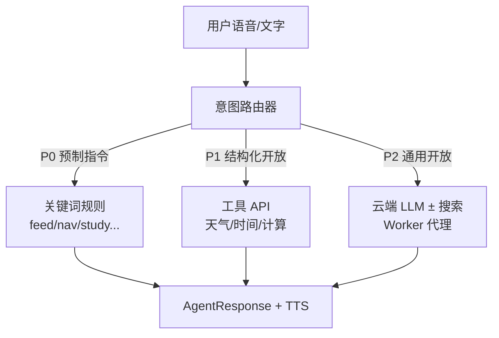
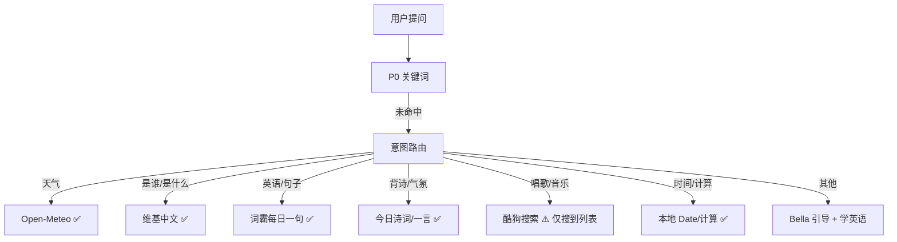

# 开放问答方案：超越关键词的「能聊感」

> 状态：**规划稿**（待评审后实施）
> 关联：[VOICE_UX_PLAN.md](./VOICE_UX_PLAN.md) · [BROWSER_COMPAT_PLAN.md](./BROWSER_COMPAT_PLAN.md) · [ARCHITECTURE.md](./ARCHITECTURE.md)
> 撰写日期：2026-08-30 · **国内实测补充：2026-08-30**

---

## 1. 问题描述

### 1.1 用户期望

用户问「今天天气怎么样」「现在几点了」「1+1等于几」等**未预制关键词**的问题时，希望 Bella **有实质回应**，而不是：

> 「嗯…我还在学习理解你说的话。试试说「帮助」？」

### 1.2 现状（mock-agent.ts）

```
用户输入 → normalize → 遍历 RULES 关键词 includes 匹配
                              ↓ 未命中
                    DEFAULT_RESPONSES 随机兜底（3 条生硬话术）
```

| 类型 | 现状 | 问题 |
|------|------|------|
| 预制指令（喂食/导航/学习） | ✅ 关键词匹配 | 说法受限，但可用 |
| 弱相关（如「天气」） | ⚠️ 有关键词但**假回答** | 「天气很好呢！不过我更关心单词…」—— 用户感知为敷衍 |
| 完全未知 | ❌ 随机兜底 | 显得「笨」、产品感差 |

### 1.3 核心诉求

> **让人感知到「有响应、有在帮忙查」，而不是「不懂」。**

不要求一开始就做实时天气级精度，但要有**可扩展的开放问答通路**。

---

## 2. 关键结论：能否用「系统自带搜索引擎」？

### ❌ 不能指望浏览器/手机「系统搜索引擎」直接回答

| 误解 | 事实 |
|------|------|
| Chrome 默认搜索引擎是 Google，网站能调它 | **没有**面向网页的「把用户问题交给默认搜索引擎并朗读结果」公开 API |
| 豆包/小爱也是搜索引擎 | 背后是 **云端大模型 + 工具调用**（搜索/天气/日历 API），不是读浏览器设置里的搜索引擎 |
| 静态 GitHub Pages 能免费搜全网 | 搜索/大模型 API 均需 **Key + 后端代理**，Key 不能写在前端 |

### ✅ 可行替代路径



**原则：关键词管「控制」，工具/LLM 管「开放聊」。**

---

## 3. 推荐架构：三层意图路由

### 3.1 路由优先级

| 优先级 | 类型 | 处理方式 | 示例 |
|--------|------|----------|------|
| **P0** | 应用控制指令 | 现有 `RULES` 关键词（保持） | 「去首页」「喂食」「开始学习」 |
| **P1** | 结构化开放问题 | **免费/低成本 API**，浏览器或 Worker 可直连 | 天气、时间、简单计算 |
| **P2** | 通用开放问题 | **免费搜索**（Worker）或 LLM | 「周杰伦是谁」「最新新闻」 |
| **P3** | 兜底 | Bella 人设化引导 + 学英语牵引 | 「这个我再去查查，我们先学个单词？」 |

### 3.2 接口改造（由同步变异步）

当前 `processUserInput(input): AgentResponse` 为**同步**，无法 await 网络请求。开放问答需改为：

```typescript
// 规划接口
export async function processUserInputAsync(
  input: string,
  context?: AgentContext
): Promise<AgentResponse>

interface AgentContext {
  city?: string;           // 用户城市（geolocation 或设置页）
  petName?: string;
  level?: number;
  tab?: TabTarget;
}

// VoiceChatBar 调用处
setAgentEmotion("thinking");
const response = await processUserInputAsync(text, ctx);
onAgentResponse(response);
```

**UX 要点：**

- 请求中：Bella 切 `thinking` 表情 + ReplyBar 显示「让我想想…」
- 超时（如 8s）：降级为 P3 兜底话术
- 失败：不静默，明确说「网络不太好，我先…」

### 3.3 与现有模块关系

```
VoiceChatBar
    → processUserInputAsync()
        ├─ rules-engine.ts      // P0 关键词（从 mock-agent 拆出）
        ├─ tools/               // P1 工具
        │   ├─ weather.ts
        │   ├─ datetime.ts
        │   ├─ calculator.ts
        │   ├─ wikipedia.ts       // P2a 纯前端百科
        │   └─ web-search.ts      // P2b Worker 全网搜
        └─ cloud-agent.ts       // P2c LLM（可选）
    → handleAgentResponse()     // 不变：emotion / navigate / feed...
    → speak() + VoiceReplyBar
```

---

## 4. 分期方案

### Phase 1 — 结构化工具（零 Key，推荐先做）

**目标：** 天气/时间/计算类问题有**真实数据**，成本为零，纯前端可完成。

| 工具 | API | Key | 说明 |
|------|-----|-----|------|
| **天气** | [Open-Meteo](https://open-meteo.com/) | 免费无需 Key | 浏览器 geolocation 取经纬度 → 查当前天气 |
| **时间** | 本地 `Date` | — | 「现在几点」直接格式化 |
| **计算** | 安全 eval / mathjs | — | 「3乘7」→ 21，需防注入 |

**意图识别（Phase 1 轻量版）：**

```typescript
// 在关键词 RULES 未命中后
if (/天气|气温|下雨|冷不冷|热不热|weather/.test(input)) → fetchWeather()
if (/几点|时间|日期|今天周几|now|time/.test(input)) → getDateTimeReply()
if (/等于|加|减|乘|除|\d+[\+\-\*\/]\d+/.test(input)) → calcReply()
```

**天气回复示例（有真实感）：**

> 「北京现在 26°C，多云，体感挺舒服的~ 出门记得带水哦！学单词前心情也不错吧？」

**局限：** 需用户授权定位；拒绝定位时用设置页默认城市或回复「你在哪个城市呀？」

**工作量：** 小（约 1–2 个工具模块 + mock-agent 改 async + VoiceChatBar loading 态）

---

### Phase 1.5 — 免费搜索 MVP（推荐在 Phase 1 天气之后）

- [ ] 部署 Cloudflare Worker 搜索网关（fork `endday/cloudflare-search` 或 `search-gateway`）
- [ ] 环境变量 `NEXT_PUBLIC_SEARCH_WORKER_URL`
- [ ] `tools/web-search.ts`：调用 Worker，取 top snippet
- [ ] `tools/wikipedia.ts`：纯前端百科 fallback（`zh.wikipedia.org` + `origin=*`）
- [ ] agent-router：关键词未命中 → 先 Wiki → 再 Worker 搜索
- [ ] ReplyBar 显示「🔍 来源：…」可选
- [ ] 超时 8s → 降级话术

### Phase 2 — 云端 LLM（可选，通用聊天）

**目标：** 任意开放问题有自然回答，仍保持「英语宠物教师」人设。

**架构：**

```
浏览器 → Cloudflare Worker（持有 API Key）
              → 通义千问 / 智谱 / Gemini / Groq 等
              → 返回 { reply, emotion?, suggestStudy? }
```

**System Prompt 要点：**

- 你是 Bella，用户的英语学习宠物伙伴
- 简短口语化，适合 TTS 朗读（≤ 80 字优先）
- 回答后可自然牵引学英语（「对了，『cloud』就是云的意思~」）
- 不编造实时数据；天气/新闻类应走工具而非幻觉

**成本：** 多数模型有免费额度；需注册云账号 + Worker 部署。

**配置：** 设置页「智能对话（实验性）」开关 + `NEXT_PUBLIC_AGENT_WORKER_URL`（与当年 TTS Worker 类似，但走 LLM）。

---

### Phase 3 — 免费开源搜索（「搜啥都行」，零 API Key）

**目标：** 关键词未命中时，Bella **联网搜一下**，读摘要回答——让用户感知「有在帮忙查」。

**前提：手机能联网 ✅**（WiFi/4G 均可）

**关键限制：** 浏览器不能直接调搜索引擎（CORS），必须经 **Cloudflare Worker** 中转（免费档约 10 万次/天，个人项目够用）。

#### 方案对比（免费优先）

| 方案 | 类型 | 搜啥都行？ | 需 Worker？ | 国内手机 | 推荐度 |
|------|------|-----------|------------|----------|--------|
| **A. CF Worker 搜索网关** | 开源，解析 DDG/Startpage HTML | ✅ | ✅ 部署 Worker | ⚠️ 看线路 | ⭐⭐⭐ **最易落地** |
| **B. SearXNG 自建** | 开源元搜索 [AGPL](https://github.com/searxng/searxng) | ✅ 聚合多引擎 | ✅ Docker + Worker 代理 | ⚠️ 看实例 | ⭐⭐⭐ 最正统 |
| **C. 维基百科 API** | 官方免费 | ⚠️ 仅百科 | ❌ 纯前端 | ✅ 通常可用 | ⭐⭐ 并联 fallback |
| **D. DuckDuckGo Instant Answer** | 官方免费 | ❌ 非完整搜索 | ❌ | ⚠️ | ⭐ 不够用 |
| **E. 公共 SearXNG 实例** | 别人搭的 | 理论上 ✅ | ❌ | ❌ | ❌ **不可靠** |

#### ❌ 公共 SearXNG：勿直接用

社区实测：从 [searx.space](https://searx.space/) 抽 38 个在线实例，**0 个**稳定返回 `?format=json`——多数 **403** 或 **429**（防爬虫）。须**自建**或用 Worker 网关。

#### ✅ 推荐：Cloudflare Worker 免费搜索网关

开源项目（fork 部署，**零 API Key**）：

| 项目 | 说明 |
|------|------|
| [endday/cloudflare-search](https://github.com/endday/cloudflare-search) | 多引擎（Startpage、DuckDuckGo、Mojeek…），Workers 免费档 |
| [EitanWong/search-gateway](https://github.com/EitanWong/search-gateway) | 模板网关，可接自建 SearXNG |
| [SearXNG](https://github.com/searxng/searxng) | 正统开源；Oracle 免费 VM / Fly.io 自建 |

**手机联网调用链：**

```
用户：「周杰伦是谁」 / 「今天北京天气」
  ↓
关键词未命中 → agent-router
  ↓
[可选] zh.wikipedia.org API（纯前端，百科类）
  ↓ 无结果
fetch(SEARCH_WORKER/search?q=...)
  ↓
Worker → Startpage / DDG / SearXNG
  ↓
JSON [{ title, snippet, url }]
  ↓
Bella：「我查了一下：周杰伦是台湾流行歌手…」
```

**纯前端百科补充（零 Worker 也可试）：**

```
GET https://zh.wikipedia.org/w/api.php?action=query&generator=search
  &gsrsearch=周杰伦&prop=extracts&exintro&explaintext&format=json&origin=*
```

#### ⚠️ 国内重要限制（实测后修正）

| 服务 | 国内大陆 | 说明 |
|------|----------|------|
| `*.workers.dev` | ❌ **被墙** | [GreatFire 全部屏蔽](https://zh.greatfire.org/domain/workers.dev)；先前推荐的 CF Worker **不能**用默认 workers.dev 域名 |
| DuckDuckGo / Startpage | ❌ **被墙** | GreatFire 确认全部屏蔽；`cloudflare-search` 依赖的引擎在国内不可用 |
| 公共 SearXNG JSON | ❌ 不可用 | 实测返回反爬验证页 HTML，非 JSON |
| **Open-Meteo** | ✅ 可用 | 实测 HTTP 200，北京 31.1°C；GreatFire 无屏蔽记录 |
| **维基中文 API** | ✅ 可用 | 实测可搜「周杰伦」；需带 User-Agent；偶发慢 |
| **cn.bing.com** | ✅ 可访问 | GreatFire 无屏蔽记录；但 HTML 页，浏览器 CORS 无法直连 |
| **词霸 iciba 每日一句** | ✅ 可用 | 含英文句 + 中文翻译 + **TTS mp3**（实测 33KB） |
| **今日诗词 / 一言** | ✅ 可用 | 免费 JSON，活跃气氛 |
| **酷狗 mobile 搜索** | ✅ 部分可用 | `mobiles.kugou.com` 可搜儿歌；播放 URL 需签名，暂不稳定 |

**结论：国内不能照搬「Worker + DDG/Startpage 全网搜」方案。** 应改为 **纯前端可用的限定 API** 组合；若必须要 Worker，须用 **自定义域名**（非 workers.dev）且后端引擎改 Bing 中国/百度等。

---

### Phase 4（可选）— 外链搜索兜底

零成本、体验一般，仅作最后兜底：

```typescript
// 用户问完全无法处理时
reply: "这个问题 Bella 还在学~ 我帮你打开搜索看看？"
action: { type: "open_search", query: userText }
// window.open(`https://www.baidu.com/s?wd=${encodeURIComponent(q)}`)
```

**优点：** 零后端  
**缺点：** 跳出 App、无法 TTS 读结果、体验割裂 — **不建议作为主方案**

---

## 5. 为什么不继续堆关键词？

| 方式 | 天气 | 100 类开放问题 | 维护成本 |
|------|------|----------------|----------|
| 继续堆关键词 | 只能假回复 | 不可扩展 | 线性爆炸 |
| Phase 1 工具 API | ✅ 真天气 | 每类写一个工具 | 中等 |
| Phase 2 LLM | ✅（+工具更好） | ✅ 通用 | 低（Prompt 统一） |

**推荐组合：P0 关键词 + P1 工具 API + P1.5 免费搜索 + P2 LLM（可选）。**

---

## 6. 天气场景端到端示例（Phase 1）

```
用户：「今天天气怎么样」
  ↓
RULES 未命中（或命中旧规则但改为走工具）
  ↓
intent = "weather" → fetchWeather(lat, lon)
  ↓
Open-Meteo: { temp: 26, weathercode: 3, city: "北京" }
  ↓
AgentResponse {
  intent: "weather",
  emotion: "happy",
  reply: "北京现在 26°C，有点多云~ 适合在家和 Bella 学单词！",
  action: "none"
}
  ↓
VoiceReplyBar 显示 + TTS 朗读
```

**若 geolocation 失败：**

> 「我还不知道你在哪个城市呢，在设置里告诉我，我就能帮你看天气啦~」

---

## 7. 实施清单

### Phase 1（天气/时间/计算）

- [ ] `mock-agent.ts` 拆为 `rules-engine.ts` + `agent-router.ts`
- [ ] `processUserInput` → `processUserInputAsync`
- [ ] `tools/weather.ts`（Open-Meteo + geolocation）
- [ ] `tools/datetime.ts`
- [ ] `VoiceChatBar` 增加 loading / thinking 态
- [ ] 设置页：默认城市（天气 fallback）
- [ ] 移除或降级现有「天气」假回复规则，改走工具

### Phase 1.5（免费搜索 MVP）

- [ ] 部署 Cloudflare Worker 搜索网关（fork `endday/cloudflare-search` 或 `search-gateway`）
- [ ] 环境变量 `NEXT_PUBLIC_SEARCH_WORKER_URL`
- [ ] `tools/web-search.ts` + `tools/wikipedia.ts`
- [ ] agent-router：关键词未命中 → Wiki → Worker 搜索
- [ ] 超时 8s → 降级话术

### Phase 2（LLM，可选）

- [ ] Cloudflare Worker `agent-chat.js`
- [ ] 环境变量 `NEXT_PUBLIC_AGENT_WORKER_URL`
- [ ] 设置页「智能对话」开关
- [ ] Prompt 模板 + 人设约束

### Phase 3（搜索 + LLM 润色，可选）

- [ ] LLM 总结搜索结果（Bella 口吻）
- [ ] 敏感/query 过滤

---

## 8. 决策记录

| 问题 | 结论 |
|------|------|
| 能用手机「系统搜索引擎」吗？ | **不能**直接调用；需 Worker 代理 |
| 手机能联网就能搜吗？ | **能**，经 Worker  outbound 请求搜索引擎 |
| 有免费开源、搜啥都行的方案吗？ | **有**：CF Worker + SearXNG 自建，或 `cloudflare-search` 等多引擎网关（零 Key） |
| 能直接用公共 SearXNG 吗？ | **不建议**；绝大多数实例禁用 JSON API（403/429） |
| DuckDuckGo 官方 API 够吗？ | **不够**；Instant Answer 非完整搜索 |
| 维基百科 API 呢？ | **免费可用**（纯前端），但只覆盖百科类问题 |
| 最小改动让天气「像真的」？ | Phase 1：Open-Meteo 免费 API |
| 最小改动让「随便问」有响应？ | Phase 1.5：Worker 搜索 + Wiki fallback |
| 完全开放聊？ | Phase 2 LLM（可选） |
| 静态站无后端能做吗？ | Wiki 可以；全网搜索需 Worker（免费） |
| 关键词还要吗？ | **要**。控制类指令继续关键词，零延迟 |

---

## 9. 与产品定位的平衡

Bella 是 **英语学习宠物**，开放问答是**增强粘性**，不是变成通用助手：

1. **回答后轻量牵引英语** — 「cloud = 云，rain = 雨」
2. **过长回答截断** — TTS 友好，≤ 80 字
3. **高频仍引导回学习 Tab** — 「聊完啦，学个新单词？」
4. **设置页可关「智能对话」** — 省流量 / 隐私 / 儿童模式

这样既解决「问天气太生硬」，又不偏离英语教育主线。

---

## 10. 国内可用性实测报告（2026-08-30）

> **测试方法：** 本环境（美国节点）curl/fetch 实测 JSON 可用性 + [GreatFire](https://zh.greatfire.org/) 大陆屏蔽记录交叉验证。  
> **注意：** 美国节点可达 ≠ 国内一定可达；被 GreatFire 标记屏蔽的，国内用户应视为 **不可用**。

### 10.1 此前方案在国内的结论

| 原方案 | 国内能用？ | 证据 |
|--------|-----------|------|
| Cloudflare Worker（`*.workers.dev`） | ❌ | GreatFire：workers.dev **全部被屏蔽** |
| endday/cloudflare-search（DDG/Startpage） | ❌ | DDG、Startpage 均被墙；Worker 域名也被墙 |
| 公共 SearXNG `?format=json` | ❌ | 实测 searx.be 返回反爬验证 HTML，非 JSON |
| DuckDuckGo Instant Answer | ❌ | GreatFire：duckduckgo.com 全部屏蔽 |
| 自建 SearXNG + 代理 | ⚠️ | 技术上可行，但需境外服务器+代理，超出零成本静态站 |

### 10.2 实测「国内友好」免费 API

| API | 实测 | 用途 | 前端直连 | 备注 |
|-----|------|------|----------|------|
| [Open-Meteo](https://open-meteo.com/) | ✅ 200, 北京 31.1°C | 真实天气 | ✅ | Phase 1 首选 |
| Open-Meteo Geocoding | ✅ 200, 「北京」 | 城市→坐标 | ✅ | 偶发超时，可重试 |
| 维基中文 API | ✅ 200, 「周杰倫」 | 「XX是谁」百科 | ✅ | `origin=*` + User-Agent |
| [词霸 iciba 每日一句](https://open.iciba.com/dsapi/) | ✅ JSON + mp3 | 每日英语 + 朗读 | ✅ | **契合英语学习定位** |
| [今日诗词 jinrishici](https://v1.jinrishici.com/) | ✅ | 背诗/活跃气氛 | ✅ | |
| [一言 hitokoto](https://v1.hitokoto.cn/) | ✅ | 随机句子 | ✅ | |
| 酷狗 `mobiles.kugou.com` 搜索 | ✅ 480 条「儿歌」 | 搜歌名 | ✅ | 播放 URL 需签名，未打通 |
| 酷狗 `complexsearch` v2 | ⚠️ err signature | — | — | 不可用 |
| 酷我 API | ⚠️ 空结果/illegal | — | — | 不可用 |
| 百度 / cn.bing HTML | ✅ 200 | 搜索 | ❌ CORS | 需服务端代理 |

### 10.3 国内推荐方案（修正版）

**不做「全网搜索」，做「限定能力 + 有真实响应」：**



#### 示例对话（国内可用）

| 用户说 | Bella 回应来源 |
|--------|----------------|
| 「今天天气怎么样」 | Open-Meteo → 「北京现在 31°C…」 |
| 「周杰伦是谁」 | 维基 API → 读首段摘要 |
| 「来句英语」 | iciba → 英文句 + 中文 + 播放 mp3 |
| 「背首诗」 | 今日诗词 → 随机古诗 |
| 「唱儿歌」 | 酷狗搜索 → 「找到《两只老虎》等儿歌~」（播放待研究） |
| 「今天新闻」 | ❌ 暂无免费国内 API → 兜底话术 |

### 10.4 若仍想要「搜索感」

| 路径 | 国内可行性 | 成本 |
|------|-----------|------|
| 自定义域名 Worker + cn.bing 爬虫 | ⚠️ 需自有域名+Worker 非 workers.dev | 低 |
| 腾讯云/百度 search API | ✅ | 试用后收费 |
| 纯前端限定 API（上表） | ✅ | **零** |

### 10.5 决策更新

| 问题 | 结论 |
|------|------|
| 之前写的 Worker 搜索国内能用吗？ | **不能**（workers.dev 被墙 + DDG/Startpage 被墙） |
| 有没有国内免费「搜啥都行」？ | **没有**可靠的零成本全网搜索 |
| 国内怎么办？ | **限定 API**：天气 + 维基 + 词霸英语 + 诗词/音乐 |
| 活跃气氛用什么？ | 词霸每日一句（带 TTS）、今日诗词、一言；酷狗搜歌（列表） |
| 下一步实现？ | **Phase 1 国内版**：Open-Meteo + iciba + 维基 + 诗词，**不上 Worker 搜索** |
