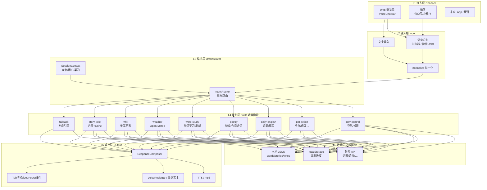
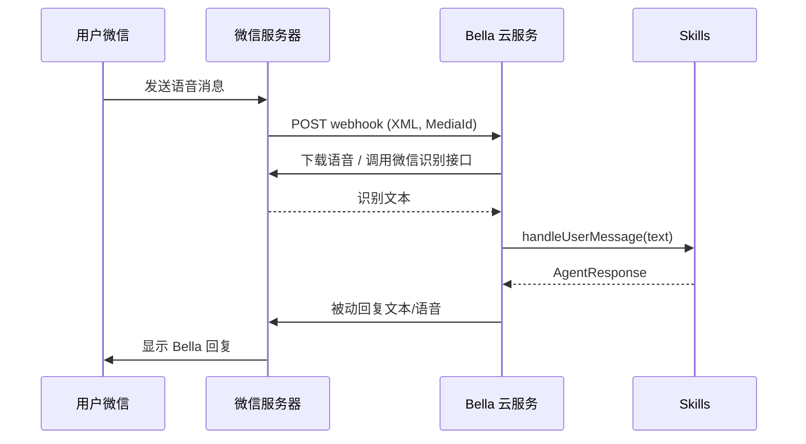
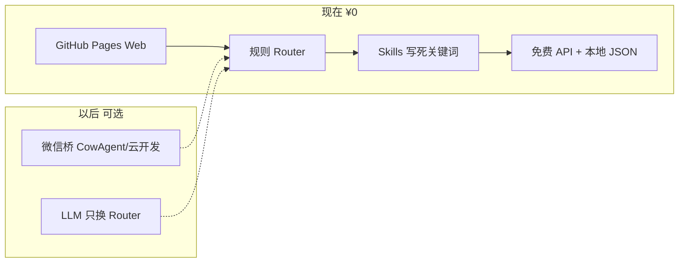

# Bella 系统架构方案（分层 + 多渠道 + 可扩展）

> 状态：**架构设计稿**（评审通过后分阶段实现）
> 关联：[ARCHITECTURE.md](./ARCHITECTURE.md) · [CONTENT_API_RESEARCH.md](./CONTENT_API_RESEARCH.md) · [OPEN_QA_PLAN.md](./OPEN_QA_PLAN.md)
> 撰写日期：2026-08-30

---

## 1. 现状：你说得对

### 1.1 现在没有 LLM / 云端 Agent

| 组件 | 现状 | 局限 |
|------|------|------|
| `mock-agent.ts` | **写死的关键词** `includes` 匹配 | 说法固定、开放问题靠兜底 |
| `VoiceChatBar` | 浏览器 STT → 文本 → `processUserInput()` | 荣耀/微信内 STT 常失败 |
| `StudyCards` + `words.ts` | **20 个固定单词** A–T 循环 | 不能「换一批」 |
| 部署 | GitHub Pages **纯静态** | 无服务端、无 Webhook |

**结论：** 当前是 **「关键词路由 + 同步回复」**，不是「模型意图识别」。这是刻意的零成本阶段，但架构上应 **预留替换点**，避免以后推倒重来。

### 1.2 目标形态（你描述的流程）

```
用户输入（语音 / 文字）
    ↓
转为文本（STT 或渠道自带识别）
    ↓
意图识别（规则 → 未来可插 LLM）
    ↓
功能模块 / Skill（每日英语、古诗、单词、导航…）
    ↓
组装响应（文字 + 情绪 + 动作 + 可选 TTS / 媒体）
    ↓
渠道回传（Web 气泡 / 微信消息 / …）
```

**是的，就应该做成这种管道。** 下面给出分层设计。

---

## 2. 分层架构总览



---

## 3. 各层职责

### L1 接入层（Channel）

**职责：** 只负责「怎么进来、怎么出去」，**不写业务逻辑**。

| 渠道 | 输入 | 输出 | 语音谁识别 |
|------|------|------|------------|
| **Web**（现有） | VoiceChatBar 麦/键盘 | ReplyBar + TTS + 页面动作 | 浏览器 Web Speech API |
| **微信**（规划） | 用户发语音/文字给公众号或小程序 | 微信文本/语音消息 | **微信 / 腾讯 ASR**（云端） |
| 未来 | App、故事机硬件 | 同上 | 渠道决定 |

**关键抽象：**

```typescript
interface ChannelAdapter {
  /** 从渠道原始事件得到统一输入 */
  toUserMessage(raw: unknown): UserMessage;
  /** 把 AgentResponse 发回渠道 */
  sendReply(msg: UserMessage, response: AgentResponse): Promise<void>;
}

interface UserMessage {
  text: string;
  channel: "web" | "wechat_mp" | "wechat_mini";
  userId?: string;
  raw?: unknown;
}
```

Web 与微信 **共用 L3–L6**，只在 L1/L2 不同。这就是你说的「云服务 + 微信通道调 API」的基础。

---

### L2 输入层

| 步骤 | Web | 微信 |
|------|-----|------|
| 语音→文本 | `startListening()` | 微信推送 `media_id` → 服务端调 [微信语音识别](https://developers.weixin.qq.com/doc/offiaccount/Service/Message_Security/Message_Security.html) 或腾讯 ASR |
| 归一化 | `normalizeInput()` 去标点、小写 | 同一函数，服务端共享 |

---

### L3 编排层（Intent Router）

**现在：** 规则引擎（关键词优先级列表）  
**以后：** 同一接口后插 LLM 分类，Skill 不变

```typescript
/** 统一入口 — Web / 微信 / 未来都调这个 */
async function handleUserMessage(
  msg: UserMessage,
  ctx: SessionContext
): Promise<AgentResponse> {
  // Phase 1: 规则
  const ruleHit = matchRules(msg.text);
  if (ruleHit) return executeSkill(ruleHit.skillId, ruleHit.params, ctx);

  // Phase 2: 按意图关键词分发到 Skill
  const skillId = detectSkillByPatterns(msg.text);
  if (skillId) return executeSkill(skillId, { query: msg.text }, ctx);

  // Phase 3（可选）: LLM 返回 { skillId, slots }
  // return executeSkill(llmResult.skillId, llmResult.slots, ctx);

  return fallbackSkill(msg.text, ctx);
}
```

**意图识别演进：**

| 阶段 | 方式 | 成本 |
|------|------|------|
| **Phase 1**（现在） | 关键词 + 正则 | 零 |
| Phase 2 | 关键词 + **Skill 注册表**（每个 Skill 声明 triggers） | 零 |
| Phase 3 | 规则未命中 → **LLM 选 Skill**（Worker） | 低 |
| Phase 4 | LLM + 多轮对话 | 中 |

**不需要一开始就有 LLM。** 先把 **Skill 插件化**，后面只换 Router 大脑。

---

### L4 能力层（Skills / 功能模块）

每个功能 = **一个 Skill 文件**，独立维护、独立测试。

| Skill ID | 触发示例 | 数据来源 | 副作用 |
|----------|----------|----------|--------|
| `nav.*` | 去首页、打开设置 | 无 | `navigate` Tab |
| `pet.*` | 喂食、睡觉 | 无 | feedPet / sleepPet |
| `english.daily` | 每日英语、来句英语 | 词霸 dsapi | TTS/mp3 |
| `english.lookup` | apple 什么意思 | 词霸词典 | TTS |
| `poetry.random` | 背诗、古诗 | 诗泉 / 今日诗词 | TTS |
| `word.refresh` | **换一批单词、刷新单词** | 本地词库 shuffle | 更新 Study 状态 |
| `word.next` | 下一个单词 | 本地 | index++ |
| `weather.query` | 天气怎么样 | Open-Meteo | 无 |
| `wiki.query` | XX是谁 | 维基 API | 无 |
| `joke.tell` | 讲笑话 | 内置 / apihz | 无 |
| `story.tell` | 讲故事 | 内置 JSON | 无 |
| `music.search` | 唱儿歌 | 酷狗搜索 | 无 |
| `help` | 帮助 | 内置 | 无 |
| `fallback` | 未识别 | 内置 | 引导 |

**Skill 接口：**

```typescript
interface Skill {
  id: string;
  /** 规则阶段用的触发词（Phase 1） */
  triggers?: string[];
  /** 正则/模式（Phase 2） */
  patterns?: RegExp[];
  /** 执行，可 async 调 API */
  execute(input: SkillInput, ctx: SessionContext): Promise<AgentResponse>;
}

interface SkillInput {
  text: string;
  slots?: Record<string, string>; // 如 word=apple
}
```

**从 `mock-agent.ts` 迁移：** 把现有 `RULES` 拆成 `skills/nav.ts`、`skills/pet.ts`… 行为不变，结构清晰。

---

### L5 数据层（Providers）

| Provider | 用途 | 刷新策略 |
|----------|------|----------|
| `providers/iciba.ts` | 每日英语、查词 | 每次请求拉最新 |
| `providers/poetry.ts` | 随机诗 | 每次 random |
| `providers/weather.ts` | 天气 | 实时 |
| `providers/wiki.ts` | 百科 | 实时 |
| `data/words.json` | **单词池**（扩容到 200+） | shuffle 取 N 个 |
| `data/stories.json` | 故事 | random |
| `data/jokes.json` | 笑话 | random |
| `pet-data.ts` | 宠物进度 | localStorage |

---

### L6 输出层

```typescript
interface AgentResponse {
  intent: string;
  reply: string;           // 主文案（所有渠道必有）
  emotion: CatMood;
  action: PetAction;
  navigate?: Tab;
  /** 扩展：微信/mp3/卡片 */
  media?: { type: "mp3"; url: string } | { type: "link"; url: string };
  /** Web 专用：触发 UI 事件 */
  uiEvents?: UiEvent[];
}

// Web: VoiceReplyBar + speak() + handleAgentResponse
// 微信: 只取 reply（+ 可选 voice 消息），不 navigate Tab
```

---

## 4. 单词「换一批」方案

### 4.1 问题

现在 `words.ts` 只有 **20 个固定词**，循环展示，无法刷新。

### 4.2 方案（推荐组合）

```
data/words.json          # 扩容词库 200–500 词（分级：小学/初中）
        ↓
WordPoolService
  - getBatch(size=10)    # 随机抽 10 个未学/或全库 shuffle
  - refreshBatch()       # 重新抽一批
        ↓
StudyCards 读 currentBatch，不是死读 WORDS 全表
        ↓
语音/按钮：「换一批」「刷新单词」→ Skill word.refresh
```

| 方式 | 说明 |
|------|------|
| **按钮「换一批」** | Study Tab UI |
| **语音「换一批单词」** | `word.refresh` Skill → 更新 batch → reply「好的，换一批新单词！」 |
| **词霸查词** | 用户说「apple 什么意思」走 `english.lookup`，与学习 batch 无关 |
| **未来** | apihz 英语词典 API 按主题拉词（需 key） |

**不需要 API 也能刷新**——关键是 **大词库 + shuffle**；API 用于「查单个词」和「每日一句」，不是替代词库。

---

## 5. 微信语音通道：可行，且适合国内

### 5.1 你的思路

> 服务部署在云上，微信里打通通道，用**微信的语音识别**，说完调我的服务返回——类似 API，不只是网页。

**结论：可行，且是解决国内 STT 的好路径。** 浏览器 STT 在荣耀/微信内不可靠，**微信渠道自带语音转文字**。

### 5.2 两种落地形态

#### 方案 A：微信公众号（服务号 + 服务器回调）



| 项 | 说明 |
|----|------|
| 需要什么 | 公众号（服务号）、备案域名、云服务器或 Serverless |
| 语音识别 | 微信开放平台「语音识别」或腾讯 ASR（国内稳定） |
| 与 Web 关系 | **同一套 `handleUserMessage` + Skills**，不同 ChannelAdapter |
| 宠物 UI | 微信侧**无** Cat3D Tab，纯对话；可 H5 链接回 Web 完整版 |

#### 方案 B：微信小程序

| 项 | 说明 |
|----|------|
| 语音 | `wx.getRecorderManager` + 插件/云开发 ASR，或 `plugin.open-api` |
| 优势 | 体验好、可嵌 H5/WebView 跳 GitHub Pages |
| 成本 | 需小程序注册、审核 |

**建议路径：** 先做 **公众号文本 + 语音消息回调**（API 形态清晰），再考虑小程序壳。

### 5.3 云服务部署选项

| 方案 | 适合 | 备注 |
|------|------|------|
| **腾讯云函数 SCF + API 网关** | 微信生态 | 与 ASR 同厂，国内快 |
| 阿里云函数计算 | 通用 | |
| Railway / Fly.io | 海外 | 微信回调需国内可访问域名 |
| Cloudflare Worker | 轻 API | `workers.dev` 国内被墙，需**自定义域名** |

**GitHub Pages 继续承载 Web UI；微信/语音 API 走独立云函数。** 双端并行，不是二选一。

### 5.4 微信 vs Web 能力差异

| 能力 | Web | 微信 |
|------|-----|------|
| 语音识别 | 浏览器 STT（不稳定） | ✅ 微信/腾讯 ASR |
| 宠物动画 | ✅ Cat3D | ❌ 除非小程序/H5 |
| Tab 导航 | ✅ | ❌ 改为文字引导「回复：去学习」 |
| 单词卡片 | ✅ StudyCards | 文字版单词 + 链接 |
| 每日英语/诗/笑话 | ✅ Skills 共享 | ✅ 同一 Skills |

---

## 6. 目录结构建议（重构目标）

```
src/
├── channels/
│   ├── web-adapter.ts       # VoiceChatBar 对接
│   └── wechat-adapter.ts    # 未来 webhook
├── core/
│   ├── router.ts            # IntentRouter
│   ├── orchestrator.ts      # handleUserMessage
│   ├── types.ts             # UserMessage, AgentResponse, SessionContext
│   └── normalize.ts
├── skills/
│   ├── index.ts             # 注册表 registerSkill()
│   ├── nav.ts
│   ├── pet.ts
│   ├── daily-english.ts
│   ├── poetry.ts
│   ├── word-study.ts        # refresh / next
│   ├── weather.ts
│   ├── wiki.ts
│   ├── story-joke.ts
│   └── fallback.ts
├── providers/
│   ├── iciba.ts
│   ├── poetry-palemoky.ts
│   ├── open-meteo.ts
│   └── wiki.ts
├── data/
│   ├── words.json           # 大词库
│   ├── stories.json
│   └── jokes.json
├── services/
│   └── word-pool.ts         # getBatch / refreshBatch
├── lib/
│   ├── speech.ts            # Web TTS/STT（保留）
│   └── pet-data.ts
└── app/ ... components/ ...  # UI 变薄，只调 orchestrator
```

**服务端（微信，独立仓库或 `server/`）：**

```
server/
├── wechat/
│   ├── webhook.ts           # 验签、收消息
│   └── voice-to-text.ts     # MediaId → 文本
├── api/
│   └── chat.ts              # POST { text, userId } → AgentResponse JSON
└── shared/                  # 与前端共享 skills（monorepo 或 npm 包）
    └── skills/              # 逻辑复用
```

---

## 7. 实施分期

### Phase A — 架构落地（Web 端，无微信）

- [ ] 抽出 `core/orchestrator.ts` + `skills/*`
- [ ] `mock-agent.ts` 改为薄封装，内部走 Router
- [ ] `processUserInput` → `handleUserMessage`（async）
- [ ] `data/words.json` + `WordPoolService` + StudyCards「换一批」
- [ ] Skill：`english.daily`、`poetry.random`、`weather`、`wiki`（Tier1 API）
- [ ] 内置 `jokes.json` / `stories.json`

### Phase B — 内容补全

- [ ] 词库扩到 200+
- [ ] 语音指令：换一批、背诗、每日英语、讲笑话…
- [ ] apihz 可选（设置页 key）

### Phase C — 微信通道（云 + API）

- [ ] 云函数 `POST /api/chat` 暴露 `handleUserMessage`
- [ ] 公众号 webhook 收语音 → ASR → chat API → 回复
- [ ] 共享 skills 包（避免 Web/微信两套逻辑）

### Phase D — 可选增强

- [ ] LLM 意图分类（仅 Router 一层）
- [ ] 微信小程序壳 + H5

---

## 8. 决策记录

| 问题 | 结论 |
|------|------|
| 现在是不是没有 LLM，只能关键词？ | **是**；应用 Skill 插件架构，以后只换 Router |
| 总体流程是不是 输入→意图→功能→响应？ | **是**，见 §2 图 |
| 单词能不能刷新？ | **能**；大词库 shuffle + `word.refresh` Skill，不依赖搜索 API |
| 微信语音调云服务是否可行？ | **可行**；微信 ASR + 同一套 Skills，Web 与微信双通道 |
| GitHub Pages 还要吗？ | **要**；Web UI + 微信 API 服务并存 |
| 先做哪个？ | **Phase A** Web 架构 + 词库刷新 + Tier1 Skills，再 Phase C 微信 |

---

## 9. 与现有文档关系

| 文档 | 内容 |
|------|------|
| 本文件 | **分层架构、Skill 模型、微信通道、词库刷新** |
| [CONTENT_API_RESEARCH.md](./CONTENT_API_RESEARCH.md) | 各 Skill 用哪些免费 API |
| [OPEN_QA_PLAN.md](./OPEN_QA_PLAN.md) | 开放问答与国内限制 |
| [ARCHITECTURE.md](./ARCHITECTURE.md) | 当前已实现细节（Cat3D、speech、部署） |

确认本架构后，按 **Phase A → B → C** 顺序开发，避免在 `mock-agent.ts` 里继续堆关键词。

---

## 10. 零成本策略 + 微信插件对接（2026-08-30 补充）

> 原则：**现金支出 ≈ 0**；Skill **不依赖** Agent/LLM；微信走「插件/桥接 + 免费额度」，不自建昂贵云服务。

### 10.1 Skill 没有 Agent 也能做 —— 你说得对

| 误解 | 事实 |
|------|------|
| 没有 LLM 就加不了 Skill | **错**。Skill = 一个功能函数；Router 用**关键词**选 Skill 即可 |
| 必须先上 Agent | **不必**。Agent 只替换 Router 的「选哪个 Skill」，Skill 本身不变 |

**演进路径（推荐）：**

```
现在：mock-agent.ts 一坨关键词          → 能跑，难维护
Phase A：拆成 skills/*.ts + 规则 Router  → 还是写死，但模块化（维护一半）
Phase B：加 Tier1 免费 API Skills        → 仍是规则触发
将来：只把 Router.match() 换成 LLM       → Skill 文件基本不动
```

**「先写死、后面再换 Agent」完全 OK。** 架构价值在于 **拆文件 + 统一入口**，不是现在就买模型。

---

### 10.2 零成本清单（现金）

| 项目 | 费用 | 说明 |
|------|------|------|
| GitHub Pages（Web UI） | **¥0** | 现有部署 |
| 词霸 / 诗泉 / 一言 / Open-Meteo / 维基 | **¥0** | 前端直连 |
| 本地 JSON（词库/笑话/故事） | **¥0** | 仓库内置 |
| 规则 Router + Skills | **¥0** | 纯 TS，无 API Key |
| 浏览器 TTS | **¥0** | Web Speech |
| 浏览器 STT | **¥0** | 国内常不可用 → 靠文字或微信通道 |

**需要花钱的常见坑（可避）：**

| 项目 | 费用 | 能否避开 |
|------|------|----------|
| 微信**服务号**认证 | ~¥300/年 | 用个人订阅号 / 小程序 / 个人号桥接 |
| 腾讯云服务器 24h | 月费 | 用云开发免费额 / Vercel 免费层 / **家里电脑** |
| CowAgent / LinkAI 托管 | 按量 | **不用**其 LLM，只借通道时要自托管 |
| LLM API | 按 token | **Phase A/B 不用** |

---

### 10.3 微信「免费通道」怎么接 Bella（插件思路）

你说的 **CloudBot / 微信机器人插件** 本质上是 **Channel 桥**：

```
微信用户（语音/文字）
    ↓
【桥接层】开源机器人 / 云开发 / 插件     ← 负责：收消息、语音识别、发回复
    ↓  HTTP POST（纯文本）
【Bella 逻辑层】handleUserMessage(text)   ← 规则 Router + Skills（零 LLM）
    ↓  JSON { reply: "..." }
【桥接层】把 reply 发回微信
```

**Bella 不需要自己买微信云服务全套**，只需暴露一个 **HTTP 接口**（或桥接层内嵌同套 TS 逻辑）。

#### 方案对比（按零成本排序）

| 方案 | 现金成本 | 语音谁识别 | 适合 |
|------|----------|------------|------|
| **A. 仅 Web（现状）** | ¥0 | 浏览器 STT（差） | 先做完 Skill |
| **B. 微信云开发云函数** | **免费额度内 ¥0** | 小程序录音 + 云 ASR 插件 | 官方路，小流量够用 |
| **C. 家里电脑跑开源桥** | **¥0**（电费） | 桥自带（如 CowAgent/Wechaty 通道） | 个人测试、低流量 |
| **D. Vercel/腾讯云函数免费层** | **¥0**（限额内） | 微信推送语音 → 函数调识别 API | 小 API 服务 |
| **E. 公众号服务号 + 自建** | ¥300/年+服务器 | 微信官方 | **不推荐**零成本阶段 |

#### 和 CowAgent（原 chatgpt-on-wechat）的关系

[CowAgent](https://github.com/zhayujie/CowAgent) 等框架：

- **强项**：微信 Channel、语音、多平台接入（插件现成）
- **默认**：后面接 **LLM**（要钱或自备 Key）
- **零成本用法**：**只当微信桥**，不接它的 Agent 大脑，改为：
  - 写 **Custom Skill / HTTP 插件**：收到文本 → `POST 你的Bella接口` → 返回 `reply` 字符串
  - 或把 `skills/` 逻辑打包成云函数，桥只转发文本

```
CowAgent Channel(微信) ──文本──► Bella /api/chat（规则+Skills，无LLM）
                                    │
                                    └── reply 文本 ◄──
```

**注意：** CowAgent 本身跑起来要有一台 **常在线机器**（旧电脑/Raspberry Pi = 零云费；云主机 = 要钱）。

#### 和「微信云开发」的关系

- 小程序 + **云函数**免费额度：可把 `handleUserMessage` 放云函数里
- 微信负责登录、录音；云函数调词霸/诗泉（出站 HTTP）
- **不需要**单独买服务器；超出免费额度才计费
- 适合：以后做「Bella 小程序版」，Web 版仍放 GitHub Pages

---

### 10.4 推荐零成本路线图（修订）



| 阶段 | 做什么 | 成本 |
|------|--------|------|
| **1** | Web + 拆 Skill + 词库刷新 + Tier1 API | **¥0** |
| **2** | 内置笑话/故事 JSON | **¥0** |
| **3** | 云函数 `/api/chat`（Vercel 免费层或云开发） | **¥0** 限额内 |
| **4** | 微信桥插件指向 `/api/chat` | **¥0** 自托管桥 |
| **5** | Router 换 LLM（可选） | 以后再说 |

**Phase C（原架构）里的「公众号 + 备案服务器」不是零成本首选**；改为 **云开发免费额** 或 **开源桥 + 免费 Serverless**。

---

### 10.5 决策更新

| 问题 | 结论 |
|------|------|
| 微信云服务要收费吗？ | 服务号认证/云主机要钱；**云开发免费额、Serverless 免费层、家里跑桥** 可 ¥0 |
| CloudBot 类插件怎么连？ | 当 **Channel 桥** → HTTP 调 Bella `/api/chat`（规则+Skills） |
| 没有 Agent Skill 能加吗？ | **能**；Skill 与 Agent 解耦，先规则后 LLM |
| 先写死可以吗？ | **可以**；拆成 `skills/*.ts` 就是「写死但可维护」 |
| 现在最该做什么？ | **Phase 1 Web + Skill 拆分**，微信等 `/api/chat` 写好再接桥 |

