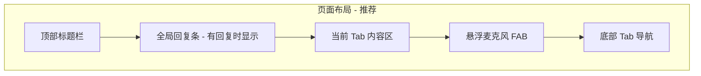

# 语音交互 UX 与指令词方案

> 状态：**部分已实现**（2026-08-30 规划 → 全局 VoiceChatBar / VoiceReplyBar / 导航指令已落地；按住说话、指令表 UI 待做）  
> 归档说明：核心诉求已满足，剩余项见 [APP_PRODUCT_PLAN.md](./APP_PRODUCT_PLAN.md) §5

---

## 1. 现状分析

### 1.1 当前语音入口的问题

| 问题 | 现状 | 影响 |
|------|------|------|
| **入口位置** | `VoiceController` 仅在「宠物」Tab 底部 | 首页/学习/设置页无法语音控制，与「语音驱动 AI 教学」定位不符 |
| **回复气泡** | `lastReply` 只在 `activeTab === "pet"` 时显示 | 其他 Tab 说话后看不到 Bella 回复 |
| **产品心智** | 用户需先切到宠物页才能说话 | 操作路径长，不像豆包/小爱等「随时可说」 |

### 1.2 当前指令词的问题

| 问题 | 示例 | 根因 |
|------|------|------|
| **缺导航指令** | 说「去首页」「打开设置」无反应 | `mock-agent.ts` 无 `nav_home` / `nav_settings` 等 intent |
| **说法太固定** | 必须含「学」「单词」才进学习页 | 关键词太少，无口语化变体 |
| **匹配太粗** | 「学」字匹配范围过大 | 单字 `includes` 易误触，且无优先级 |
| **动作未落地** | 「洗澡」只回复文字，不触发 `bathePet` | intent 有回复但 `handleAgentResponse` 未处理 |
| **无指令帮助** | 用户不知道能说什么 | 缺少「帮助」「你能做什么」类指令 |

### 1.3 现有可复用能力

```
用户说话 → VoiceController → processUserInput() → AgentResponse
                                              ↓
                              handleAgentResponse() → setActiveTab / feedPet / ...
                                              ↓
                              speak() TTS 回复
```

架构已具备全局语音的基础，缺的是 **UI 全局化** 和 **指令词体系扩展**。

---

## 2. 语音入口 UI 方案（类豆包悬浮）

### 2.1 设计目标

- **任意 Tab 可语音**，无需先切到宠物页
- **一键可达**，拇指友好（手机端主场景）
- **状态可见**：待机 / 聆听 / 朗读 三态清晰
- **不遮挡核心内容**（学习卡片、宠物画面）

### 2.2 推荐方案：底部悬浮 FAB + 全局回复条



#### 布局规格（移动端）

```
┌─────────────────────────────┐
│  🏠 首页          🪙 40     │  ← header
├─────────────────────────────┤
│  💬 Bella: 好的，我们去学习 │  ← 全局 VoiceReplyBar（可选展开）
├─────────────────────────────┤
│                             │
│      （当前 Tab 内容）       │
│                             │
│                    ┌────┐ │
│                    │ 🎤 │ │  ← FAB 悬浮按钮
│                    └────┘ │     bottom: 80px
│                           right: 20px
├─────────────────────────────┤
│  首页  宠物  学习  设置      │  ← 底部导航 (h≈56px)
└─────────────────────────────┘
```

| 元素 | 位置 | 说明 |
|------|------|------|
| **VoiceFAB** | 右下角，`bottom: calc(56px + 16px + safe-area)` | 56px 圆形，粉色主色，阴影 |
| **VoiceReplyBar** | header 下方，全宽 | 显示最后一句话 + Bella 回复，可点击展开历史 |
| **聆听态** | FAB 变红 + 脉冲动画 | 与现 VoiceController 一致 |
| **朗读态** | FAB 变绿 + 波纹 | TTS 播放中 |

#### 交互细节

| 操作 | 行为 |
|------|------|
| 点击 FAB | 开始 STT 聆听（同现逻辑） |
| 再次点击 | 停止聆听 |
| 长按 FAB（可选 P2） | 弹出文字输入面板 |
| STT 不可用 | FAB 变为文字输入图标，点击展开输入条 |
| 说话完成 | 全局 ReplyBar 显示识别文本 + Bella 回复 |

#### 为何不用「底部导航中间凸起」

- 现有 4 Tab 已占满底栏，中间插入会破坏导航对称性
- FAB 浮在内容区右下角，**不改动 Tab 结构**，改动面小
- 与豆包、ChatGPT App 的「悬浮球」心智一致

#### 组件拆分（实施时）

```
page.tsx
├── VoiceFAB          # 新建：悬浮按钮 + 状态
├── VoiceReplyBar     # 新建：全局回复条
└── VoiceController   # 重构：逻辑层（STT/TTS/输入），UI 拆出
```

`VoiceController` 保留语音逻辑，UI 拆为 `VoiceFAB` + `VoiceReplyBar`，从 `renderPetPage()` 移到 `page.tsx` 根布局。

---

## 3. 语音指令词体系

### 3.1 指令分类与优先级

匹配时按 **优先级从高到低**，避免「学」误触：

| 优先级 | 类别 | 说明 |
|--------|------|------|
| P0 | **导航** | 切 Tab：首页/宠物/学习/设置 |
| P1 | **学习动作** | 开始学习、测验、朗读、下一个 |
| P2 | **宠物动作** | 喂食、玩耍、洗澡、睡觉 |
| P3 | **系统** | 签到、帮助、改名 |
| P4 | **闲聊** | 你好、谢谢、再见 |

### 3.2 完整指令词表（含模糊说法）

#### P0 — 导航（新增，当前缺失）

| intent | 触发动作 | 关键词（含模糊口语） |
|--------|----------|----------------------|
| `nav_home` | `setActiveTab("home")` | 首页、主页、回到首页、去首页、home、回主页、看看首页 |
| `nav_pet` | `setActiveTab("pet")` | 宠物、看猫、看 Bella、去宠物、我的猫、pet、猫猫 |
| `nav_study` | `setActiveTab("study")` | 学习、去学习、学单词、学英语、上课、背单词、study、learn、读书 |
| `nav_settings` | `setActiveTab("settings")` | 设置、打开设置、配置、选项、settings、语音设置、调整 |

#### P1 — 学习动作

| intent | 触发动作 | 关键词 |
|--------|----------|--------|
| `study` | 切学习 Tab | （同 nav_study，合并处理） |
| `quiz` | 切学习 Tab + 启动测验模式 | 测验、考试、考我、测试、quiz、test、做题目 |
| `read_word` | 学习页朗读当前单词 | 朗读、读一下、怎么读、发音、read |
| `next_word` | 学习页下一个单词 | 下一个、下个词、继续、next |

#### P2 — 宠物动作

| intent | 触发动作 | 关键词 |
|--------|----------|--------|
| `feed_pet` | `feedPet()` + 切宠物 Tab（可选） | 喂、吃、饿、喂食、feed、hungry |
| `play_pet` | `playWithPet()` | 玩、玩耍、游戏、play、陪我玩 |
| `bathe` | `bathePet()` | 洗澡、洗、bath、干净 |
| `sleep` | `sleepPet()` | 睡、困、休息、睡觉、sleep、tired |

#### P3 — 系统

| intent | 触发动作 | 关键词 |
|--------|----------|--------|
| `checkin` | `dailyCheckIn()` | 签到、打卡、checkin、签到领金币 |
| `help` | 播报可用指令列表 | 帮助、你能做什么、指令、怎么说、help、命令 |

#### P4 — 闲聊（保留现有）

| intent | 关键词 |
|--------|--------|
| `greeting` | 你好、嗨、hello、早、晚上好 |
| `thanks` | 谢谢、thanks |
| `goodbye` | 再见、拜拜、bye |
| `introduce` | 叫什么、名字、who are you |

### 3.3 模糊匹配策略（升级 mock-agent）

当前：`lower.includes(keyword)` 顺序命中即返回 — **太粗糙**。

**推荐改为三层匹配：**

```typescript
// 1. 输入预处理
function normalizeInput(raw: string): string {
  return raw
    .toLowerCase()
    .replace(/[，。！？、,.!?'\s]/g, "")
    .trim();
}

// 2. 每条规则带 priority + keywords
// 3. 打分：完全匹配 > 包含匹配 > 同义词
function scoreMatch(input: string, keyword: string): number {
  if (input === keyword) return 100;
  if (input.includes(keyword)) return 50 + keyword.length;
  return 0;
}

// 4. 取全表最高分；同分取 priority 高者
```

**STT 常见误识别容错（P2 可选）：**

| 用户想说 | STT 可能识别成 | 处理方式 |
|----------|----------------|----------|
| 学习 | 雪习、学系 | 同义词表 / 编辑距离 ≤1 |
| 设置 | 设制 | 模糊匹配 |
| Bella | 贝拉、呗啦 | 别名表 |

**冲突消解示例：**

- 「我想去学习」→ 含「学习」→ `nav_study`（P0 导航优先于泛「学」字）
- 「去宠物页喂食」→ 含「宠物」→ `nav_pet`；若已在宠物页且含「喂」→ `feed_pet`

### 3.4 AgentResponse 扩展

```typescript
export interface AgentResponse {
  intent: string;
  emotion: "happy" | "sad" | "surprised" | "neutral" | "thinking";
  action: "feed" | "play" | "study" | "quiz" | "greeting" | "checkin" | "none";
  reply: string;
  // 新增
  navigate?: "home" | "pet" | "study" | "settings";  // 导航目标
  studyAction?: "quiz" | "read" | "next";            // 学习页子动作
}
```

`handleAgentResponse` 补充：

```typescript
if (response.navigate) setActiveTab(response.navigate);
if (response.intent === "bathe") bathePet(...);
if (response.intent === "sleep") sleepPet(...);
if (response.studyAction === "quiz") /* 通知 StudyCards 进入测验 */;
```

---

## 4. 「帮助」指令示例回复

用户说「帮助」或「你能做什么」时，Bella 朗读：

```
你可以这样跟我说：
· 去首页、看宠物、开始学习、打开设置
· 喂我、陪我玩、洗澡、睡觉
· 签到、测验、朗读
· 随便聊天也可以哦！
```

---

## 5. 实施分期

### Phase 1 — 最小可用（推荐先做）

- [ ] 新建 `VoiceFAB` + `VoiceReplyBar`，挂载到 `page.tsx` 全局
- [ ] 从宠物页移除原 VoiceController 嵌入
- [ ] 扩展 mock-agent：P0 导航 4 条 + P2 洗澡/睡觉动作落地
- [ ] `handleAgentResponse` 处理 `navigate` 字段
- [ ] 更新 ARCHITECTURE.md

**预估改动：** 4 个文件，~200 行

### Phase 2 — 指令增强

- [ ] 打分式模糊匹配替代 includes
- [ ] P1 学习子指令（朗读、下一个、测验）
- [ ] `help` 指令 + 设置页「语音指令说明」
- [ ] StudyCards 暴露 `startQuiz()` / `speakWord()` 给 page 调用

### Phase 3 — 体验 polish（可选）

- [ ] 长按 FAB 文字输入
- [ ] 回复历史面板
- [ ] STT 误识别同义词表
- [ ] 说「停止」取消朗读

---

## 6. 风险与注意

| 风险 | 缓解 |
|------|------|
| FAB 遮挡学习页按钮 | 右下角留 20px 边距；学习页可略增 `padding-bottom` |
| 导航后用户迷失 | ReplyBar 播报「好的，我们来到学习页」 |
| 关键词冲突 | priority 分层 + 最长关键词优先 |
| 学习页子指令跨组件 | page 用 ref/callback 调 StudyCards |

---

## 7. 决策记录

| 决策 | 选择 | 理由 |
|------|------|------|
| 悬浮位置 | 右下角 FAB | 不破坏底栏，拇指可达，类豆包 |
| 回复展示 | 顶部全局 ReplyBar | 任意 Tab 可见 Bella 回复 |
| 匹配算法 | 打分 + 优先级（Phase 2） | Phase 1 可先扩关键词，Phase 2 升级算法 |
| 导航指令 | 独立 P0 优先级 | 解决「只能去宠物页说话」和「无法语音切 Tab」 |

---

## 8. 附录：现有 vs 规划指令覆盖对比

| 用户说法 | 现在 | 规划后 |
|----------|------|--------|
| 「去首页」 | ❌ 无反应 | ✅ nav_home |
| 「打开设置」 | ❌ 无反应 | ✅ nav_settings |
| 「我想学单词」 | ✅ 进学习（含「学」） | ✅ nav_study |
| 「开始测验」 | ✅ 进学习（含「测验」） | ✅ quiz + 自动开测验 |
| 「给猫洗澡」 | ⚠️ 只说话不洗澡 | ✅ bathe + 执行动作 |
| 「签到」 | ✅ 仅首页按钮可点 | ✅ 任意页语音签到 |
| 「帮助」 | ❌ 随机回复 | ✅ 播报指令列表 |

---

## 9. 语音交互 v2 — 按住说话 & 静音自动发送

> **完整版见 [APP_PRODUCT_PLAN.md](./APP_PRODUCT_PLAN.md) §5**  
> 背景：当前「点按 → 正在听 → 12s 超时」只能说一句，且易卡在「正在听…」。

### 9.1 对标成熟产品

| 产品 | 核心交互 |
|------|----------|
| **微信** | 按住说、松手发；上滑取消/锁定 |
| **豆包 / 通义** | 开麦后 **停顿 1–2s 自动发送**，可多句 |
| **ChatGPT Voice** | 会话内连续说，静音结束一轮 |

### 9.2 推荐双模式（设置可选默认）

| 模式 | 操作 | 结束 |
|------|------|------|
| **按住说话**（建议默认） | 按住麦克风 | 松手即发送；上滑取消（Phase 2） |
| **点按 + 静音发送** | 点一下 | interim 停顿 **1.5s** 自动发送；再点停止 |
| **文字** | 切键盘 | Enter 发送 |

### 9.3 超时策略调整

| 旧 | 新 |
|----|-----|
| 固定 12s 无论是否在说 | 按住：最长 60s；点按：1.5s 静音发送 + 8s 完全无声才提示 |
| 结束常显「被中断」 | 主动 stop 的 aborted 不提示（已实现） |

### 9.4 技术要点

- `SpeechRecognition.continuous = true` + `interimResults = true`
- 客户端计时：interim 无更新 > `silenceMs` → `onFinal(transcript)`
- VoiceChatBar：`onTouchStart`/`onTouchEnd` 区分 hold vs tap

### 9.5 实施顺序

1. **V-1** 按住说话（P0）
2. **V-2** 点按 + 1.5s 静音自动发送
3. **V-3** 上滑取消 + 设置项「默认语音模式」
